# Une Baguette Fromage 🥖🧀

This write-up shares the strategies, infrastructure, insights, and research process that brought us to **1st place in Europe, 4th place globally out of 18,803 teams in IMC Prosperity 4 (2026)**, a 5-round international quantitative trading competition with both algorithmic trading and manual quant challenges. Overall, our team was awarded **$3500 prize money** for top performance and achieved a final PnL score of **1,386,318 XIREC**.

<table width="80%">
  <tbody>
    <tr>
      <td align="center" valign="top" width="200px">
          
           
          
<b>Jasper van der Ende</b>

      </td>
      <td align="center" valign="top" width="200px">
          
           
          
<b>Teun Schuur</b>

      </td>
      <td align="center" valign="top" width="200px">
          
           
          
<b>Thomas St Ges</b>

      </td>
      <td align="center" valign="top" width="200px">
          
           
          
<b>Guilhem Doat</b>

      </td>
      <td align="center" valign="top" width="200px">
          
           
          
<b>Dylan Conrad</b>

      </td>
    </tr>
  </tbody>
</table>

 

As many top-performing teams from previous Prosperity iterations have done, we decided to publish this writeup to give back to the Prosperity community.

We believe Prosperity is one of the rare competitions where sharing approaches genuinely raises the bar for everyone. Every public writeup forces future participants — and IMC itself — to push the limits further. Previous teams’ writeups helped us tremendously during the competition, so this document is our attempt to continue that cycle.

That said, getting to the top was not just about getting lucky and finding a magical strategy. We systematically tested every possibility we could think of, building our own understanding of the markets IMC had created instead of blindly applying textbook techniques.

Our goal with this document is not only to explain what worked, but also:
- how we approached research,
- how we validated ideas,
- how we avoided overfitting,
- and how we navigated an absurdly large search space under extreme time pressure.

 

## IMC Prosperity 4

IMC Prosperity 4 (2026) was a global algorithmic trading competition consisting of multiple rounds across several weeks, with more than 22,000 teams participating worldwide.

Participants developed trading algorithms to maximize profits against simulated markets populated by various bots and hidden behaviors. Over the course of the competition, new products and mechanics were gradually introduced, forcing teams to constantly adapt their strategies and research process.

The competition touched many areas of quantitative trading and research:
- market making,
- statistical arbitrage,
- microstructure analysis,
- derivatives pricing,
- signal extraction,
- event-based trading,
- optimization,
- and game theory.

Each round also featured a separate manual challenge involving probabilistic reasoning, auctions, optimization, or strategic decision-making.

 

## Structural Overview

- [Tools & Infrastructure](#tools--infrastructure)
- [Wall Mid](#wall-mid)
- [On Vibe Coding](#on-vibe-coding)
- [Algorithmic Challenge](#algorithmic-challenge)
  - [Round 1](#round-1)
  - [Round 2](#round-2)
  - [Round 3](#round-3)
  - [Round 4](#round-4)
  - [Round 5](#round-5)
- [Manual Challenge](#manual-challenge)
  - [Round 1](#manual-round-1)
  - [Round 2](#manual-round-2)
  - [Round 3](#manual-round-3)
  - [Round 4](#manual-round-4)
  - [Round 5](#manual-round-5)
- [FAQ](#faq)

 

# Tools & Infrastructure

One of our earliest decisions was to make sure we did not rely solely on the native IMC tester.

Instead, we forked and heavily extended Jmerle’s backtester and visualizer for Prosperity 4.

Having a proper local environment was absolutely essential for us, especially because the round timers were brutal:
- 72 hours per round during qualifications
- 48 hours per round during finals

This leaves very little room for slow feedback loops.

The backtester gave us:
- local exchange simulation,
- position limits,
- fair value updates,
- trader replay,
- and rapid parameter testing

without needing to constantly submit to the official platform.

Being able to run hundreds of local simulations in minutes instead of waiting on the website queue was a massive advantage.

 

## Dashboard

On top of the core backtester, we built a heavily customized dashboard environment.

<table>
<tr valign="top">
<td width="100%" align="center">
  <strong>Figure 1: Dashboard Overview</strong>
</td>
</tr>

<tr valign="top">
<td width="100%" align="center">
  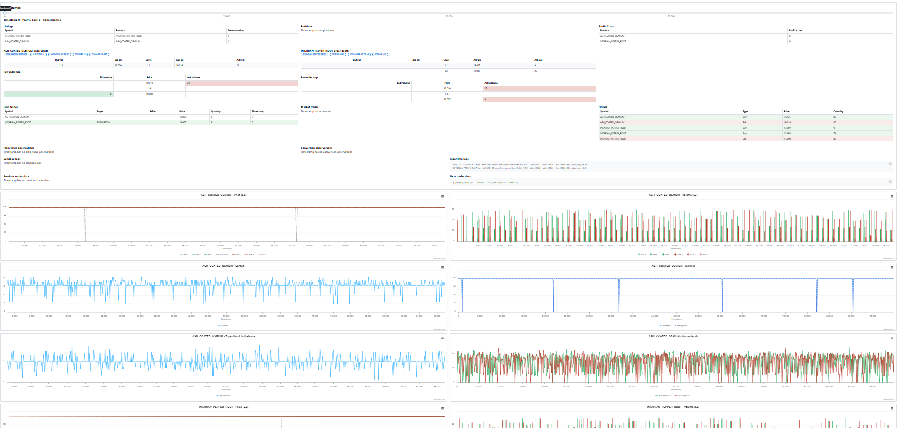
</td>
</tr>

<tr valign="top">
<td width="100%" align="center">
  <strong>Figure 2: Analyzer Overview</strong>
</td>
</tr>

<tr valign="top">
<td width="100%" align="center">
  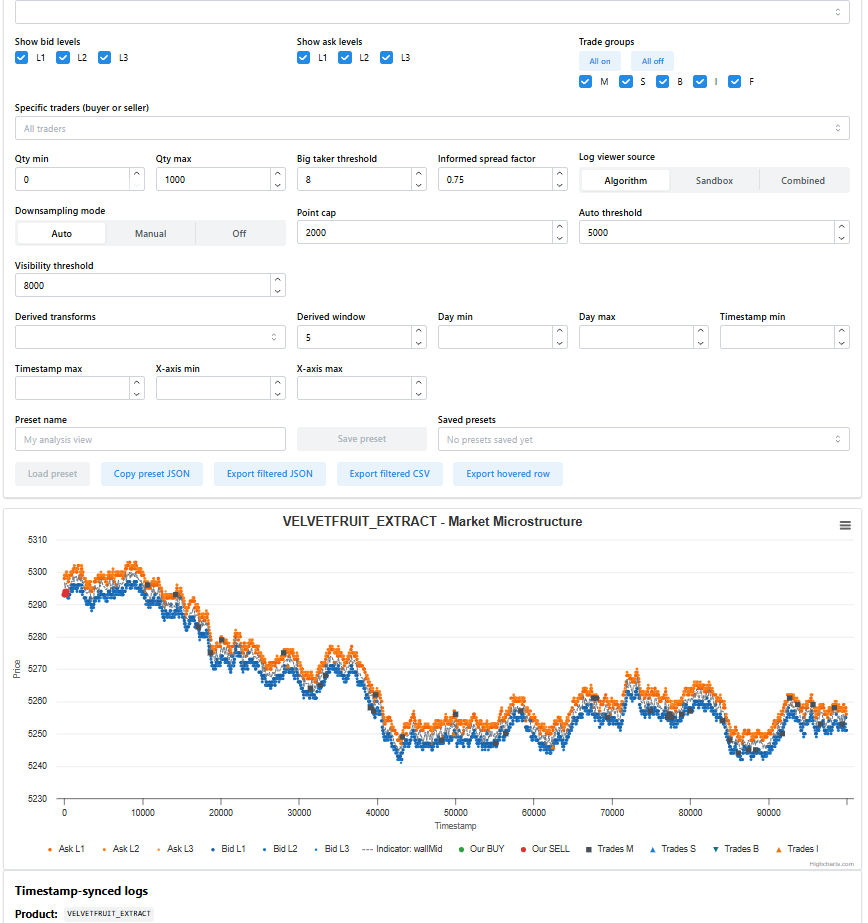
</td>
</tr>

<tr valign="top">
<td width="100%" align="center">
  <em>Overview of the custom visualization dashboard used throughout the competition.</em>
</td>
</tr>
</table>

Key additions included:
- Price and mid-price charts with fair value overlays
- Volume profiles per product and timestamp
- PnL attribution broken down per product
- Visualization of counterparty trades
- Position tracking over time
- Dynamic graphing support for arbitrary indicators

The dashboard became one of our most important research tools throughout the competition.

We used it constantly for:
- validating hypotheses,
- spotting hidden behaviors,
- understanding microstructure,
- and debugging strategies.

 

## Jupyter Workflow

Alongside the dashboard, we relied heavily on Jupyter notebooks.

The notebooks acted as our scratchpad for:
- exploratory analysis,
- signal research,
- residual analysis,
- autocorrelation testing,
- parameter optimization,
- and visualization.

We found the separation between:
- notebooks for fast experimentation,
- and the dashboard for validation

to be extremely effective.

 

## Git Workflow

We also maintained a lightweight git branching structure.

Each product family had its own branch, while the main branch only received tested competition-ready code.

This prevented the classic Prosperity failure mode:
fixing one product at 3AM and accidentally breaking another one.

Version discipline ended up saving us repeatedly during later rounds.

 

## A Note on Backtester Limitations

One thing we want to stress:

Local backtesting has real structural limitations.

Ignoring them leads directly to overfit strategies that look incredible locally and collapse live.

The most important limitations we encountered were:
- No market impact
- Simplified orderbook dynamics
- Imperfect bot behavior replication

Our philosophy became:

> Use the backtester as a filter, not as ground truth.

If a strategy failed locally, we discarded it.

If it passed locally, we still questioned it aggressively before trusting it live.

Strategies with absurdly good backtests were usually overfit.

 

# Wall Mid

One of the most important concepts throughout the competition was what we called the **Wall Mid**.

The standard midpoint between best bid and best ask was often a terrible estimate of actual fair value.

This was because:
- bots aggressively overbid,
- undercutting constantly occurred,
- and top-of-book prices were noisy.

During testing on the official Prosperity platform, it became possible to indirectly infer the underlying fair value through unrealized PnL changes.

Buying or selling tiny amounts and observing resulting PnL changes gave clues about where the simulator itself considered fair value to be.

We found that the best estimate consistently came from large persistent liquidity walls deeper in the book.

These walls:
- remained stable,
- appeared highly informed,
- and often anchored around the simulator’s internal fair value.

So instead of using the naive midpoint, we:
1. identified dominant liquidity walls,
2. extracted bid and ask wall prices,
3. and took the midpoint between those levels.

This produced a significantly cleaner and more predictive estimate of fair value.

<table>
<tr valign="top">
<td width="100%" align="center">
  <strong>Figure 3: Wall Mid vs Raw Mid (Ash-Coated Osmium)</strong>
</td>
</tr>

<tr valign="top">
<td width="100%" align="center">
  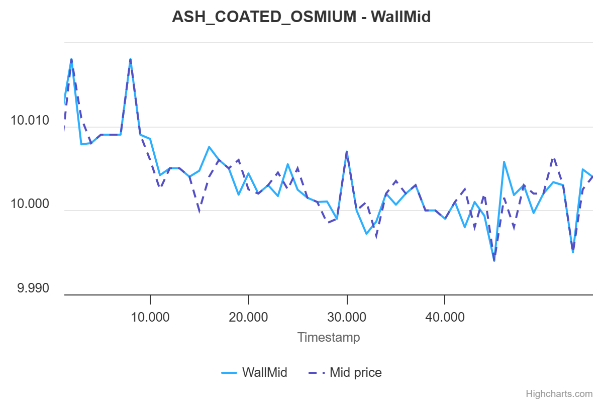
</td>
</tr>

<tr valign="top">
<td width="100%" align="center">
  <em>Comparison between noisy top-of-book midpoint and Wall Mid estimation.</em>
</td>
</tr>
</table>

 

# On Vibe Coding

We want to be honest about something that rarely makes it into writeups:

A significant portion of our tooling and research was built through what the community now calls **vibe coding**.

Fast, iterative, heavily AI-assisted development became one of the most important tools during the competition.

In a competition like Prosperity, you simply cannot afford to spend:
- six hours architecting perfect pipelines,
- writing elegant abstractions,
- or polishing infrastructure

when there are only 30 hours left in a round.

The correct move is often:
1. get something working quickly,
2. validate the idea,
3. then decide whether it deserves cleanup.

Concretely, this included:
- rapidly prototyping parsers,
- building one-off scanners,
- dynamically extending the dashboard,
- generating parameter sweep harnesses,
- and quickly validating statistical ideas.

The key discipline is knowing:
- when AI-generated code is acceptable,
- and when every line must be manually verified.

We kept a strict separation:
- exploratory tooling could be messy,
- production strategy code had to be understood completely.

Used correctly, vibe coding became an enormous force multiplier.

 

# Algorithmic Challenge

## Round 1

Round 1 introduced two products, both with max position 80.

### OSMIUM

The first product introduced was ASH_OSMIUM_OSMIUM, which we simply called OSMIUM.

OSMIUM was essentially:
- large spread,
- slowly mean reverting,
- occasionally crossing the Wall Mid,
- and highly suitable for market making.

After a quick Augmented Dickey-Fuller test, we confirmed that it was stationary around approximately 10,000, with p-value below 0.0005.

<table>
<tr valign="top">
<td width="100%" align="center">
  <strong>Figure 4: OSMIUM Orderbook</strong>
</td>
</tr>

<tr valign="top">
<td width="100%" align="center">
  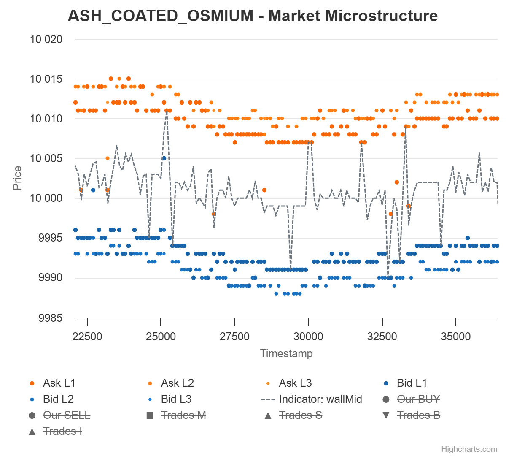
</td>
</tr>

<tr valign="top">
<td width="100%" align="center">
  <em>Typical OSMIUM orderbook behavior.</em>
</td>
</tr>
</table>

#### Empty Book Behavior

One of the first major discoveries was what happened when one side of the book became empty; When quoting on an empty side, sometimes a taker showed up that took your quote.

This happened roughly 8% of the time, on both products.

We tested increasingly aggressive quotes and discovered that a spread of exactly 100 around previous Wall Mid maximized profitability while still getting filled.

Using rough averages:
- trade frequency around 0.047,
- average trade size around 5,
- and captured spread around 100,

this gave about 23 expected PnL per empty-side event.

Over a full day, that translated into roughly 18.6k expected PnL for OSMIUM alone.

#### Final Strategy

Our OSMIUM strategy became a relatively standard Avellaneda-Stoikov style market maker with inventory management.

The reserve price shifted linearly with inventory:

S_r = 10000 - γQ

where:
- Q = inventory
- γ controlled inventory pull strength

We found γ = 1/12 to perform best.

The strategy:
- penny quoted around fair value,
- crossed spread when sufficiently favorable,
- and widened aggressively when one side became empty.

More concretely, we used an inventory-adjusted reserve price of the form

S_r = 10000 - gamma * Q

with gamma = 1/12, so the adjustment at max inventory was roughly 6.7.

When one side of the order book disappeared, we did not use the full width of 100 in production.

Instead, we quoted a spread of 98 around Wall Mid as a small safety margin against Wall Mid estimation error.

 

### INTARIAN_PEPPER_ROOT

The second asset was INTARIAN_PEPPER_ROOT, which we called PEPPER_ROOT.

Unlike OSMIUM, it increased almost deterministically by 0.1 every tick.

<table>
<tr valign="top">
<td width="100%" align="center">
  <strong>Figure 5: PEPPER_ROOT Orderbook</strong>
</td>
</tr>

<tr valign="top">
<td width="100%" align="center">
  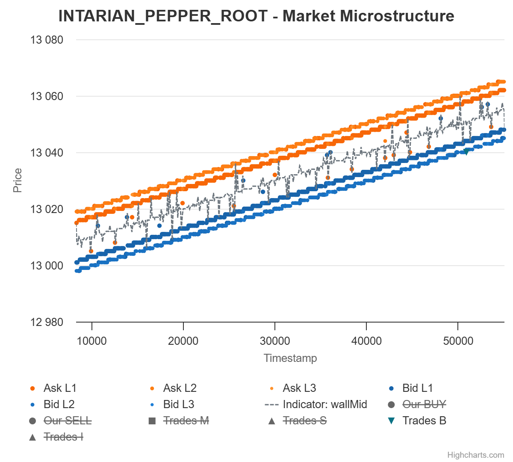
</td>
</tr>

<tr valign="top">
<td width="100%" align="center">
  <em>Typical PEPPER_ROOT orderbook behavior.</em>
</td>
</tr>
</table>

The obvious strategy was:
> buy and hold

However, the average spread was around 14, which was too attractive to ignore for market making.

The problem was that market making a deterministically drifting product is less trivial than it first appears.

#### Dynamic Programming Model

For Round 1, we modeled PEPPER_ROOT with dynamic programming.

The idea was to compute the optimal expected future value for every:
- time step,
- inventory level from -80 to 80,
- spread state,
- and trade-size realization.

The model used:
- deterministic drift of 0.1 per tick,
- per-side trade rate around 0.017,
- and an empirical trade-size distribution centered around roughly 5.14.

This produced bid and ask thresholds describing the worst prices at which quoting was still positive EV.

Rather than putting the full Bellman derivation inline, the compiled formulation we used is shown below.

<table>
<tr valign="top">
<td width="100%" align="center">
  <strong>Figure 6: PEPPER_ROOT Bellman Compilation</strong>
</td>
</tr>

<tr valign="top">
<td width="100%" align="center">
  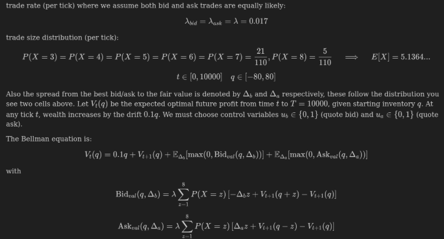
</td>
</tr>

<tr valign="top">
<td width="100%" align="center">
  <em>Bellman setup used to derive PEPPER_ROOT quote thresholds.</em>
</td>
</tr>
</table>

Once we had the value function, the strategy became simple:
- penny the best bid or ask when the corresponding threshold allowed it,
- market take when the threshold crossed the opposite best quote,
- and use the same empty-book quote of spread 98 when one side disappeared.

This first approach did not work quite as well as we hoped.

So instead of using the raw thresholds directly, we introduced:
- a bid adjustment parameter,
- an ask adjustment parameter,
- and optimized both with a grid search over realized PnL.

The best values were:
- bid adjustment = 4,
- ask adjustment = 5.

This was clearly not perfect, and we later fixed the modeling issue properly in Round 2.

But it still outperformed pure buy-and-hold.

 

## Round 2

### Extra Market Access

Round 2 introduced the ability to bid for “extra market access.”

If your bid was above the median submitted bid, you received access to an expanded market feed.

The catch was that this "extra access" only meant:
- roughly 20% more quotes,
- but not 20% more trades.

This was an intentional red herring.

Why would one pay for more competition against other market makers?

The obvious answer became:
> bid zero.

 

### Strategy Changes

The OSMIUM strategy itself did not materially change from Round 1.

However, Round 2 exposed a weakness in our implementation.

We had hard-coded the fair value at 10,000, and that anchor did not hold perfectly on this round's data.

As a result, we spent too much time pinned at max inventory, which weakened both:
- the mean reversion component,
- and the market making component.

Looking back, we should have added a fail-safe:
- if inventory stayed maxed for long enough,
- we should have gradually shifted our assumed fair value toward the observed market mid.

There was not any hint that this could've happened though, since in the complete historical data for OSMIUM, it's fair value was always 10,000
PEPPER_ROOT changed more meaningfully.

In Round 1, our dynamic programming model still relied on "adjustment" parameters to compensate for hidden modeling errors.

We did not like that.

So for Round 2 we fixed the DP formulation itself by explicitly incorporating:
- spread distributions,
- and the arrival of large-spread takers.

This produced much cleaner bid and ask thresholds and removed the need for the earlier bid/ask adjustment parameters.

We placed 4th in this round, but the OSMIUM underperformance made it clear that even a good structural model still needed defensive safeguards.

 

### Recurring Takers Research

During the intermission period following Round 2, we performed broader research into generalized alpha sources.

By that point, the admins had already announced that OSMIUM and PEPPER_ROOT would not carry forward into the remaining Phase 2 rounds.

So the goal of this research was not to squeeze the last bit of PnL out of those products.

The goal was to identify product-agnostic alpha sources that might generalize into later rounds.

This led to one of our most interesting discoveries.

Across many instances on both OSMIUM and PEPPER_ROOT, takers reappeared:
- at identical timestamps,
- with identical side,
- and with identical size,
- on consecutive days.

We eventually identified the underlying mechanism:

If a taker appeared at:
- timestamp t
- on day d

then there was a very high probability the same taker appeared again:
- at timestamp t
- on day d+1

The effect appeared to be strongly one-day dependent:
- day d takers had strong predictive power for day d+1,
- but much less direct predictive power for day d+2 unless the same event also appeared on day d+1.

So we modeled these transitions as a Markov-style recurrence process across products and rounds.

<table>
<tr valign="top">
<td width="50%" align="center">
  <strong>Figure 7: OSMIUM Taker Recurrence</strong>
</td>
<td width="50%" align="center">
  <strong>Figure 8: PEPPER_ROOT Taker Recurrence</strong>
</td>
</tr>

<tr valign="top">
<td width="50%" align="center">
  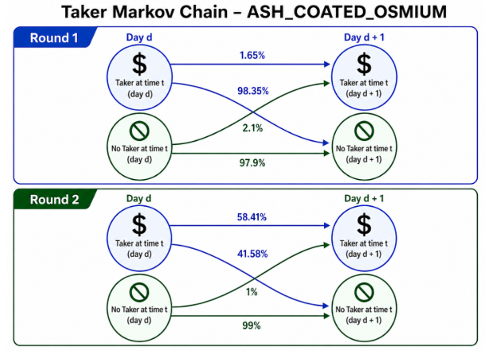
</td>
<td width="50%" align="center">
  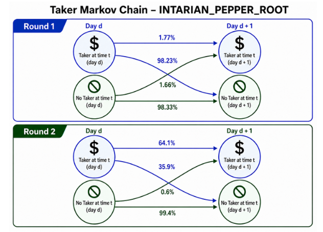
</td>
</tr>

<tr valign="top">
<td width="100%" colspan="2" align="center">
  <em>Recurring taker probabilities across consecutive days for OSMIUM and PEPPER_ROOT.</em>
</td>
</tr>
</table>

The round-to-round difference was especially noticeable:
- this recurring-actor behavior was very strong in Round 2,
- and much weaker in Round 1.

For OSMIUM:
- takers with size ≥ 7
- repeated with ~97.7% probability.

#### Monetizing This

At first glance, this does not obviously look monetizable.

Knowing when a taker will arrive is only useful if the matching engine lets you reshape the book first.

That is exactly what the Prosperity simulator allowed.

If we predicted a large taker would arrive:
1. we cleared all existing liquidity,
2. leaving one side empty,
3. then placed an extreme quote,
4. which the taker would often immediately hit.

This effectively recreated hidden-taker opportunities.

Of course, this came with a tradeoff:
- clearing the book imposed an immediate adverse execution cost,
- so the expected taker fill had to be strong enough to justify it.

 

## Round 3

### HYDROGEL_PACK

HYDROGEL_PACK behaved similarly to OSMIUM:
- slowly mean reverting,
- average spread around 16,
- and consistently liquid.

The main difference from OSMIUM was that HYDROGEL_PACK was somewhat more volatile, while never exhibiting the empty-book behavior that made OSMIUM so profitable.

That made the product relatively straightforward compared to what came next.

<table>
<tr valign="top">
<td width="100%" align="center">
  <strong>Figure 9: HYDROGEL_PACK Orderbook</strong>
</td>
</tr>

<tr valign="top">
<td width="100%" align="center">
  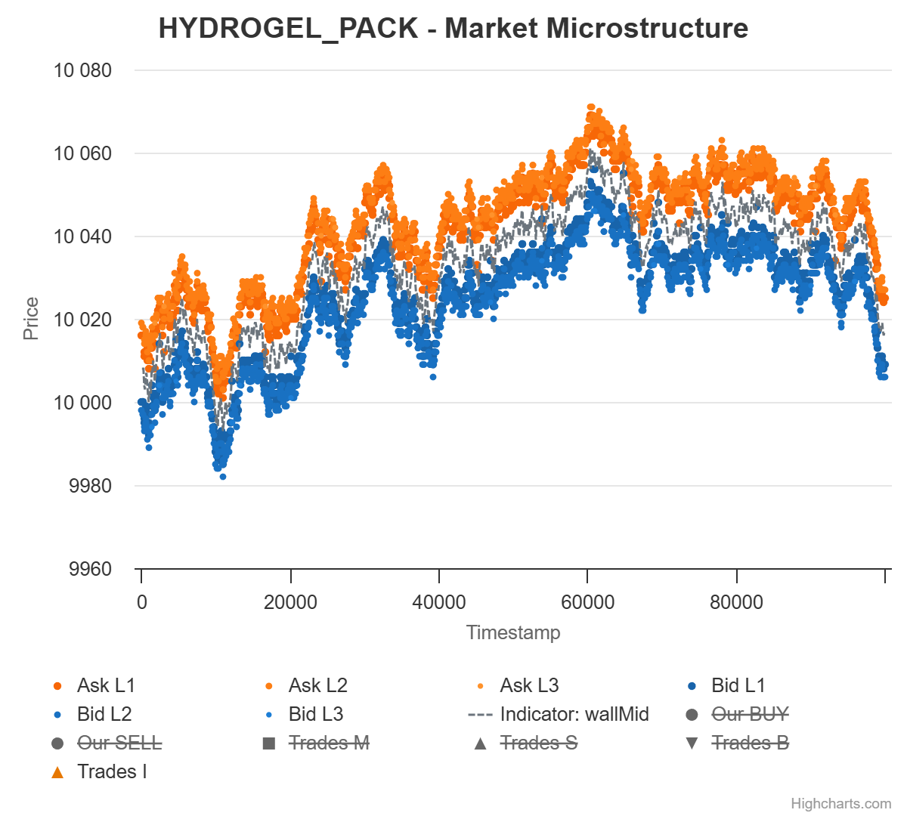
</td>
</tr>

<tr valign="top">
<td width="100%" align="center">
  <em>Typical HYDROGEL_PACK orderbook behavior.</em>
</td>
</tr>
</table>

 

### VELVETFRUIT_EXTRACT

VELVETFRUIT_EXTRACT was also mean reverting, but with a much tighter spread of around 5 and significantly higher volatility.

A simple Avellaneda-Stoikov market maker no longer worked well due to:
- tighter spreads,
- larger jumps,
- and higher short-term volatility.

<table>
<tr valign="top">
<td width="100%" align="center">
  <strong>Figure 10: VELVETFRUIT_EXTRACT Orderbook</strong>
</td>
</tr>

<tr valign="top">
<td width="100%" align="center">
  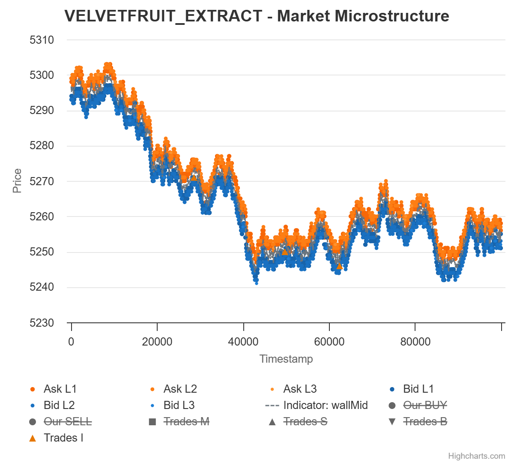
</td>
</tr>

<tr valign="top">
<td width="100%" align="center">
  <em>Typical VELVETFRUIT_EXTRACT orderbook behavior.</em>
</td>
</tr>
</table>

We instead modeled the product as an Ornstein-Uhlenbeck process.

Estimated parameters:
- mean ≈ 5250
- theta ≈ 0.15
- sigma ≈ 9.8

This implied a long-term OU volatility of approximately

Omega = sigma / sqrt(2 * theta) ≈ 18

This became our primary threshold.

#### Final Strategy

The resulting strategy became extremely simple:
- buy below 5232
- sell above 5268

Despite its simplicity, this performed surprisingly well.

 

### Options

Round 3 also introduced 10 call options written on VELVETFRUIT_EXTRACT.

Initially, we expected IV surface trading opportunities similar to Prosperity 3.

However, analysis revealed:
- implied volatility remained almost constant,
- per option,
- throughout each day.

This completely destroyed the standard 'fit parabola → trade IV mispricing' approach.

<table>
<tr valign="top">
<td width="100%" align="center">
  <strong>Figure 11: IV smile</strong>
</td>
</tr>

<tr valign="top">
<td width="100%" align="center">
  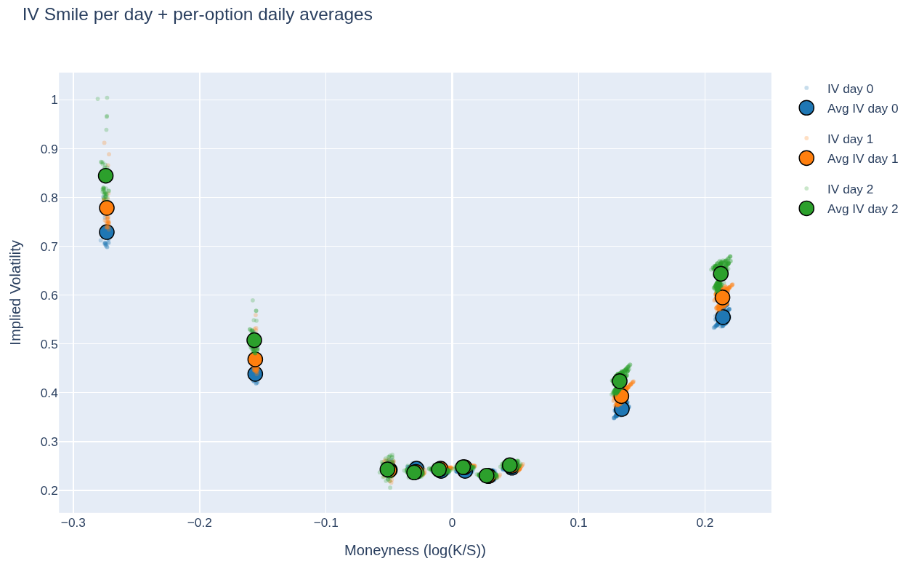
</td>
</tr>

<tr valign="top">
<td width="100%" align="center">
  <em>Typical VELVETFRUIT_EXTRACT orderbook behavior.</em>
</td>
</tr>
</table>

Instead, we concluded the options were essentially priced fairly.

Therefore:
- the options themselves contained little standalone alpha,
- but they could still be used to leverage mean reversion exposure on the underlying.

The resulting thresholds were computed through:
- Black-Scholes pricing,
- using each option's average IV for that day,
- and evaluating the underlying at the OU thresholds around 5250 ± 18.

We also briefly investigated whether certain bot trades in lower strikes such as VEV_4000 near rolling extrema were predictive of reversals.

In retrospect, this was mostly an artifact of the underlying itself being mean reverting rather than a genuinely distinct signal.

 

## Round 4

Round 4 largely kept the Round 3 product set, but added trader Marks.

### Monte Carlo Option Thresholds

This round pushed us to improve our voucher trading substantially.

We built a Monte Carlo framework that:
- simulated future VELVETFRUIT_EXTRACT paths using our Ornstein-Uhlenbeck model
- priced each voucher along those paths with Black-Scholes
- kept a fixed implied volatility per voucher

This gave us a much more realistic estimate of the distribution of future option values than using a single OU threshold on the underlying.

The main reason this mattered was **Theta**.

Even if the underlying reverted in the expected direction, the vouchers were constantly losing time value.

So the correct buy and sell thresholds could not be based only on expected terminal value:
- they also had to compensate for time decay,
- especially for the more out-of-the-money vouchers.

We therefore optimized thresholds directly on simulated PnL outcomes.

Our final objective was:
> E[PnL] - 0.25 Std(PnL)

rather than maximizing Sharpe ratio.

This deliberately chose a more aggressive point on the risk-return frontier:
- higher expected PnL,
- but also materially higher variance.

In hindsight, this likely explains why Round 4 went worse for us than the previous round.

We do not think the approach was fundamentally wrong.

It was simply more exposed to bad short-run realization.

### Mark Analysis

Most Marks turned out to be far less informative than we initially hoped.

There was a lot of temptation to build broad Mark-conditioned strategies, but for most Marks the signal was either too weak, too unstable, or too hard to monetize in real time.

Only a small subset consistently mattered:
- Mark 14 emerged as the dangerous informed maker,
- Mark 01 as an informed VELVET buyer and voucher harvester,
- Mark 67 as a small but real specialist,
- Mark 38 and Mark 55 as anti-informed takers,
- and Mark 22 as a one-sided seller of out-of-the-money vouchers.

One relationship dominated the round:
> Mark 14 versus Mark 38.

Roughly 60% of HYDROGEL flow came from this pair.

Around 80% of Mark 14's real PnL also came from trading against Mark 38.

#### Machine Learning Experiments

We performed significant ML research during this round.

The research split into two very different stories.

General Mark-conditioned path-max strategies looked extremely promising offline.

However:
> almost all collapsed once translated into executable real-time rules.

The one exception was much narrower:
- a focused random forest model for predicting Mark 38 trades.

That signal was useful because Mark 38's trades often arrived just before very large upward or downward price moves.

Still, we remained highly cautious with ML throughout the competition.

 

## Round 5

What made Round 5 incredibly complex was not necessarily the trading itself, but figuring out what actually mattered inside an absurdly large search space.

The surprise jump to 50 assets completely changed the way we approached research.

Previous rounds naturally pushed teams toward understanding a handful of products deeply.

Round 5 instead tempted everyone into building giant correlation matrices and searching for structure everywhere at once.

Initially, we did too.

We spent a large part of the first day building scanners and validators for:
- cross-family correlations,
- basket residuals,
- rolling z-score deviations,
- cointegration tests,
- lead-lag relationships,
- and microstructure imbalance signals.

And to be honest, at first it looked like we had found basically unlimited alpha.

Entire families appeared tightly linked.
Baskets showed extreme mean reversion.
Products seemed to predict each other with almost suspicious precision.
Dozens of plots looked beautiful, and many strategies produced extremely strong in-sample backtests.

That made us more skeptical rather than less.

Our biggest risk at that point was convincing ourselves that the market was far more structured than it really was.

So we forced proper out-of-sample validation:
- fit on two days,
- test on the third.

The result was a disaster.

Relationships that looked statistically convincing immediately collapsed:
- residuals became non-stationary,
- hedge ratios changed sign,
- correlations weakened or inverted,
- and most cross-family pairs that had looked like statistical candy turned into rotten fruit instantly.

We think this is also why there were so many misleading "huge alpha" claims in Discord.

If you searched hard enough, it really was possible to find absurdly profitable backtests.

The hard part was finding relationships that actually survived out-of-sample.

### What Survived

In the end, the live strategy was much simpler than our research notebook graveyard suggested.

The backbone was broad market making.

Just making markets across many assets was already highly profitable, especially because much of the taker flow was effectively shared across products.

If we got filled, we often got filled in many assets at once, which reduced effective exposure at the portfolio level because the large basket of products was much less volatile than any single name.

For most products, that meant simply quoting aggressively inside the spread.

For a couple of families such as TRANSLATORS and GALAXY_SOUNDS, we used a slightly better Wall-Mid-style market maker with inventory skew.

On top of that baseline, only a few alpha layers survived the cut.

The family-level PnL attribution after the round reinforced that story.

The clearest winners were:
- OXYGEN_SHAKES at about +669k (Wow!)
- PEBBLES at about +22.4k
- SNACKPACKS at about +19.1k
- TRANSLATORS at about +11.7k
- PANELS at about +9.3k
- GALAXY_SOUNDS at about +5.5k

Those were mostly families where either broad market making alone was already strong, or where the extra structure we kept live was at least directionally helpful.

In particular, OXYGEN_SHAKES were actually our main PnL source, which is important context for the microstructure alpha discussed below.

The weak spots were just as informative:
- MICROCHIPS lost about 26.8k,
- SLEEP_PODS lost about 14.0k,
- UV_VISORS lost about 7.0k,
- and ROBOTS lost about 4.3k.

So even though some of those families had research ideas we found statistically interesting, live attribution made it clear that not all of them translated into robust production alpha.

### Residual Baskets

Most of the grand cross-family structure was thrown out.

Only a handful of residual baskets were robust enough to keep live.

The final submission traded mean reversion on a small set of family combinations:
- MICROCHIPS,
- SLEEP_PODS,
- SNACKPACKS,
- and one DOMESTIC_ROBOTS basket.

These were implemented as weighted basket residuals with fixed mean and volatility thresholds, plus a killswitch for extreme dislocations.

This was a much narrower version of our original vision for the round.

The live attribution was mixed.

Some families clearly did not justify the complexity:
- MICROCHIPS finished deeply negative,
- and SLEEP_PODS also lost meaningfully.

That is exactly the kind of result we had been worried about when so many residual relationships collapsed out-of-sample.

SNACKPACKS were more nuanced.

The return structure there was genuinely interesting:
- VANILLA and CHOCOLATE were about -0.92 correlated,
- RASPBERRY and STRAWBERRY were negatively correlated with each other,
- and the RASPBERRY-plus-STRAWBERRY basket showed structure against PISTACHIO.

<table>
<tr valign="top">
<td width="100%" align="center">
  <strong>Figure 12: SNACKPACK Correlation Structure</strong>
</td>
</tr>

<tr valign="top">
<td width="100%" align="center">
  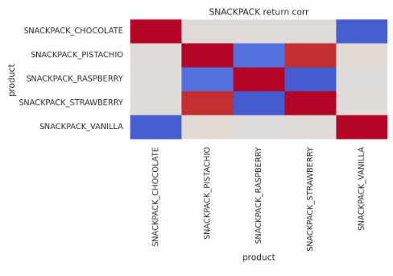
</td>
</tr>

<tr valign="top">
<td width="100%" align="center">
  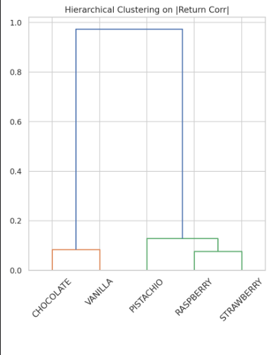
</td>
</tr>

<tr valign="top">
<td width="100%" align="center">
  <em>Correlation structure inside the SNACKPACK family.</em>
</td>
</tr>
</table>

We did try basket trading and arbitrage around this.

However, it did not end up being nearly as profitable as the cleanest live structures.

So although SNACKPACKS still finished strongly positive at about +19.1k, that was more a validation of the simpler final structure than of an elaborate family-arbitrage thesis.

### DaFuck Alpha

The cleanest standalone microstructure signal was what we internally called the **DaFuck alpha**.

<table>
<tr valign="top">
<td width="100%" align="center">
  <strong>Figure 13: DaFuck Alpha</strong>
</td>
</tr>

<tr valign="top">
<td width="100%" align="center">
  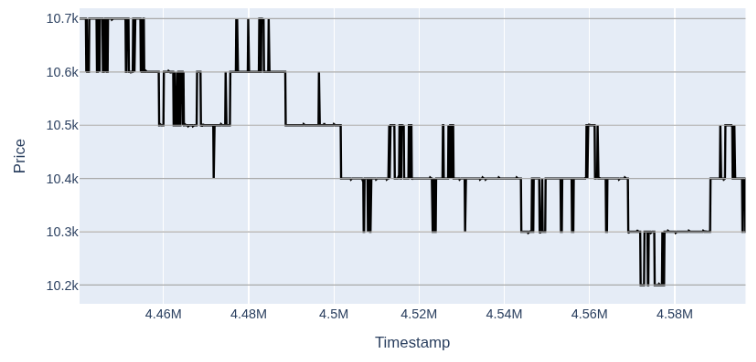
</td>
</tr>

<tr valign="top">
<td width="100%" align="center">
  <em>Example of the short-horizon jump-and-revert behavior we exploited in Round 5.</em>
</td>
</tr>
</table>

This pattern appeared on random products at random times, but in our live results the clearest and most important manifestation was OXYGEN_SHAKE_CHOCOLATE.

What happened was that price would jump to the nearest round 100 level, such as 10.3k or 10.4k, and once it jumped there, the probability of quickly jumping back was far above 50%.

So in practice it behaved like a very short-horizon mean reversion signal.

The implementation was correspondingly simple:
- detect a sufficiently large jump after a few stable ticks,
- assume the move is likely to revert,
- and immediately take liquidity on the opposite side.

This was one of the easiest real alphas to identify and monetize.

In hindsight, this also explains why OXYGEN_SHAKES ended up as our biggest winning family.

By contrast, ROBOTS still finished slightly negative overall at about -4.3k, so although the same effect did show up there in the historical data, it was not the main source of realized PnL.

### UV_VISORS

Our initial lead-lag research produced a lot of false positives, so by late Round 5 we were already suspicious of almost every such result.

Then, in the final hours, we found one lead-lag structure in UV_VISORS that actually looked real.

The effect itself was modest: certain visor products appeared to turn, and roughly half a day later another visor product tended to follow,

That was not the kind of signal you build a huge standalone strategy around with 90 minutes left.

So we implemented the smallest thing that could plausibly monetize it: a regime overlay.
It either added or subtracted 1 tick from fair value on a couple of specific leader-lagger pairs.

This caused a lot of stress because it was found very late, but it did make it into the final bot.

The final attribution there was mildly negative, with UV_VISORS ending around -7.0k.

So we still think the structure was real, but the live implementation was too small and too late to become a major source of PnL.

### PEBBLES

PEBBLES turned out not to be one magical alpha with a clean verbal explanation.

Looking at our final submission, the live PEBBLES strategy was really a synthetic family-pricing model with a few extra lagged signals layered on top.

The core fair value assumption was that the five PEBBLES products approximately summed to a stable anchor around 50,000.

So for any one product, we priced it synthetically as:
- 50,000
- minus the observed prices of the other four sizes.

That gave a synthetic fair value for each pebble size, after which we:
- applied inventory skew,
- quoted around that reservation price,
- and took liquidity when the observed market was sufficiently far away.

On top of that, we added a few cross-size lag rules, for example:
- PEBBLES_XS reacting to prior moves in PEBBLES_XL and PEBBLES_L,
- PEBBLES_S reacting to prior moves in PEBBLES_M and PEBBLES_XS,
- and PEBBLES_XL reacting to prior moves in PEBBLES_L.

Some pebble sizes were therefore mostly plain synthetic market making, while others had a directional regime overlay from those lagged triggers.

So for our final alpha:
> the PEBBLES alpha in our final bot was a synthetic basket fair-value model with a small amount of hand-tuned intra-family lead-lag logic, not one single elegant standalone edge.

Attribution supports that interpretation quite well: PEBBLES ended up as our strongest Round 5 family at about +22.4k.

### Final Strategy Philosophy

In the end:
- we discarded most cross-family complexity,
- kept only the most robust relationships,
- relied heavily on broad market making,
- and layered only a small number of specific alphas on top.

Ironically, a few components we still suspected might be slightly overfit ended up live anyway, simply because at some point you have to stop researching and submit.

 

# Manual Challenge

## Round 1

The first manual round involved auction optimization.

**Key insight:** You pay the *clearing price*, not your bid. Bid price only sets queue position. Quantity controls whether your bid pushes the clearing price up via the higher-price tie-break rule.

**Method:** For each (bid_price, qty) candidate, simulate the auction: build the volume curve (demand≥P vs supply≤P at every level), pick the price with max traded volume (ties → higher price), then allocate by price→time priority. Profit = fill × (buyback − clearing − fee). Grid-search over all integer prices ≤ buyback, with fine sweep around analytically-derived clearing-transition thresholds.

**FLAX → BID 9,999 @ 30 → profit 9,999**
Without your order, clearing = 28 (40k traded). Adding 9,999 demand at p=30 makes p=29 also tie at 40k → clearing = 29 (margin 1). At 10,000, p=30 also ties → clearing jumps to 30, profit = 0.

**EMBER → BID 19,999 @ 20 → profit 77,996.10**
Baseline clears at 15 (86k traded). Adding 19,999 demand pushes p=16 to 91k traded → clearing = 16 (margin 3.90). At 20,000, p=17 also hits 91k → clearing jumps to 17, profit collapses.

**Total: 87,995**

This ended up topping the leaderboard, with the actual distribution being:
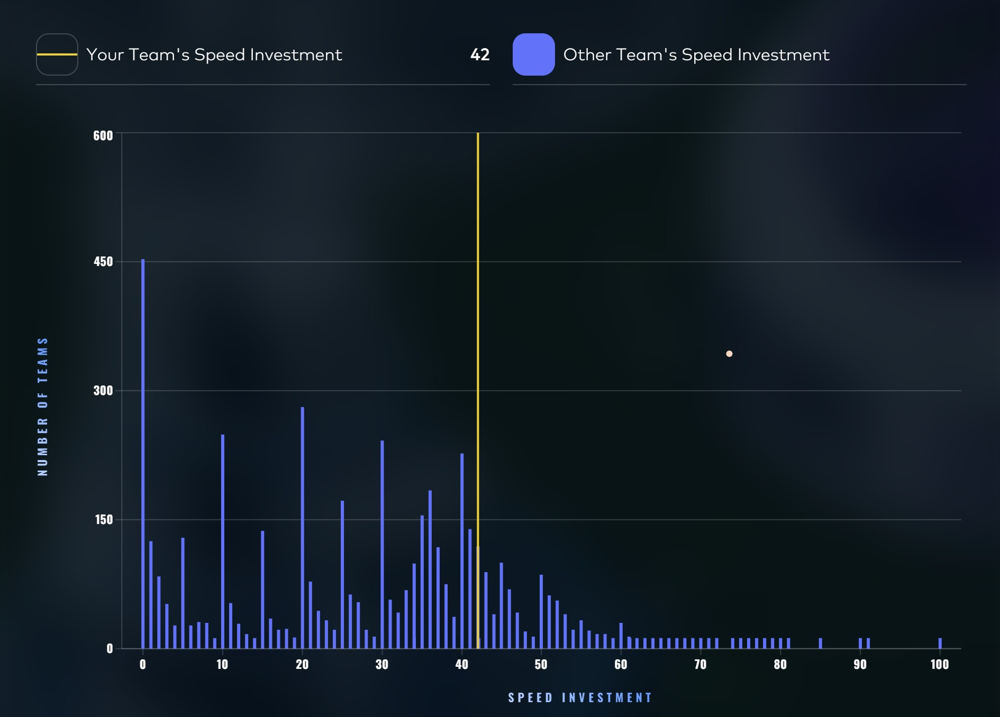

 

## Round 2

# Invest & Expand — Optimal Strategy

**The challenge:**

You are expanding your outpost into a true market making firm with a budget of `50 000` XIRECs. You need to allocate this budget across three pillars:

- **Research**
- **Scale**
- **Speed**

You choose percentages for each pillar between 0–100%. Total allocation cannot exceed 100%. Your final PnL (Profit and Loss) score is:

<aside>
ℹ️

PnL = (Research × Scale × Speed) − Budget_Used

</aside>

### **The pillars**

**Research** determines how strong your trading edge is. It grows **logarithmically** from `0` (for `0` invested) to `200 000`  (for `100` invested). The exact formula is `research(x) = 200_000 * np.log(1 + x) / np.log(1 + 100)`. Here, `np.log` is a python function from NumPy package for natural logarithm.

**Scale** determines how broadly you deploy your strategy across markets. It grows **linearly** from `0` (for `0` invested) to `7` (for `100` invested).

**Speed** determines how often you win the trades you target. It is **rank-based** across all players:

- Highest speed investment receives a `0.9` multiplier.
- Lowest receives `0.1`.
- Everyone in between is scaled linearly by rank, equal investments share the same rank.

**Our strategy**

The crux of this challenge is of course the game theory problem of estimating the distribution of speed allocations among all the teams. This dictates our own choice of speed allocation, and from this we can compute the allocations for research and scale that maximize PnL.

Our strategy to approaximate the speed distribution is based on a simple assumption: a large number of teams will base their allocation on the recommendations of their favourite LLM. Therefore, by using these companies' APIs, we can query these models a large number of times to gauge what their take on this challenge is. 

In practice, what we did is use the information above as a seed prompt, and asked Claude to write 6 prompts based on it, mimicking different player prototype. Then, we called prompted a number of different models using those, and compiled the results in a .csv file.

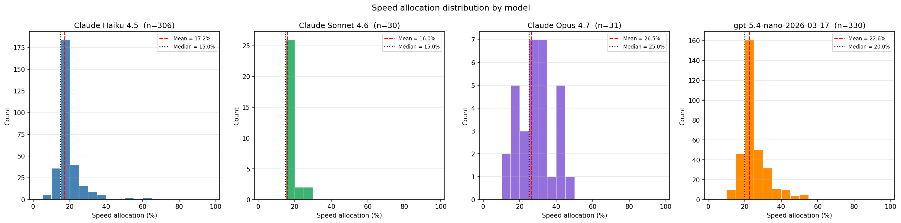
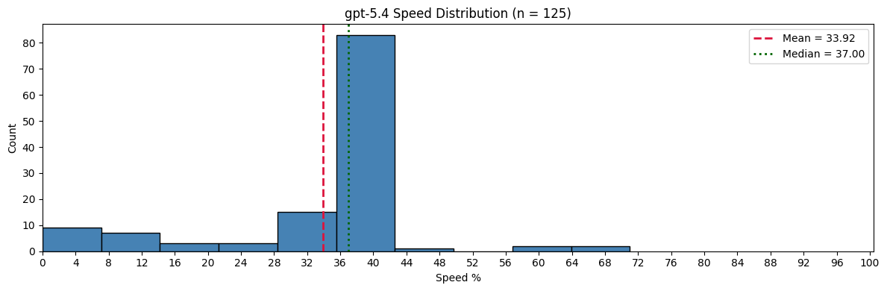

Using this, and our in-house optimizer, we settled on 15 for research, 43 for scale, 42 for speed

 

# Round 3 Manual trading challenge: “The Celestial Gardeners’ Guild”

You trade against a number of counterparties that all have a **reserve price** ranging between **670** and **920**. On the next trading day, you’re able to sell all the product for a fair price, **920**.

The distribution of the bids is **uniformly distributed** at **increments of 5** between **670** and **920**. 

<aside>
📃

**Example**: counterparties may have reserve prices at 675 and 680, but not at 676, 677, 678, 679, etc..

</aside>

You may submit **two bids**. If the first bid is **higher** than the reserve price, they trade with you at your first bid. If your second bid is **higher** than the reserve price of a counterparty and **higher** than the mean of second bids of all players you trade at your second bid. If your second bid is **higher** than the reserve price, but **lower** than the mean of second bids of all players, the chance of a trade rapidly decreases: you will trade at your second bid **but** your PNL is penalised by 

$$
\left(\frac{920 - \text{avg(b2)}}{920 - b2}\right)^3
$$

## 1. Problem setup

We bid to buy a product from many counterparties. Each counterparty has a hidden reserve price $R$ drawn uniformly from the grid

$$\mathcal{R} = \{670, 675, 680, \dots, 915, 920\} \quad (|\mathcal{R}| = 51)$$

Anything bought is resold at $A = 920$. We submit **two bids** $b_1 < b_2$.

Per counterparty:

$$
\text{profit}(R;\, b_1, b_2) =
\begin{cases}
A - b_1 & \text{if } R < b_1 \\
(A - b_2) \cdot P(b_2) & \text{if } b_1 \le R < b_2 \\
0 & \text{if } R \ge b_2
\end{cases}
$$

with the **penalty factor**

$$
P(b_2) =
\begin{cases}
1 & \text{if } b_2 \ge \overline{b_2} \\
\left( \dfrac{A - \overline{b_2}}{A - b_2} \right)^3 & \text{if } b_2 < \overline{b_2}
\end{cases}
$$

where $\overline{b_2}$ is the mean of $b_2$ across *all players* (unknown at submission time).

## 2. Expected profit per counterparty

Using the uniform distribution of $R$:

$$
\mathbb{E}[\pi \mid b_1, b_2] = \frac{1}{51}\Bigl[\{ \text{number of} R \in \mathcal{R} : R < b_1\}\cdot (A - b_1)+\{ \text{number of} R \in \mathcal{R} : b_1 \le R < b_2\}\cdot (A - b_2)\cdot P(b_2)\Bigr]
$$

Continuous approximation (useful for deriving optima) — replace counts by lengths / 250:

$$
\mathbb{E}[\pi] \;\approx\; \frac{(b_1 - 670)(A - b_1) \;+\; (b_2 - b_1)(A - b_2)\, P(b_2)}{250}
$$

## 3. Joint optimum (ignoring the penalty, i.e. assuming $b_2 \ge \overline{b_2}$)

Taking partials and setting to zero:

$$
\frac{\partial \mathbb{E}[\pi]}{\partial b_1} = 0 \;\Rightarrow\; b_1^\star = \tfrac{1}{2}(670 + b_2)
$$

$$
\frac{\partial \mathbb{E}[\pi]}{\partial b_2} = 0 \;\Rightarrow\; b_2^\star = \tfrac{1}{2}(A + b_1) = \tfrac{1}{2}(920 + b_1)
$$

Solving the system:

$$
b_1^\star \approx 753.3,\qquad b_2^\star \approx 836.7,\qquad \mathbb{E}[\pi^\star] \approx 83.3
$$

On the discrete integer grid, the top of the flat ridge is $(b_1, b_2) = (751, 835)$ or $(751, 840)$, both yielding $\mathbb{E}[\pi] = 83.0$.

Strategic takeaway #1 — the coupling

$b_1$ and $b_2$ **cannot** be optimised independently. Optimising only the "$b_1$-leg" gives $b_1 = 795$ (midpoint of 670 and 920), which leaves ~6% expected profit on the table. The correct rule is

$$
b_1 \approx \frac{670 + b_2}{2}
$$

## 4. The penalty and the game-theory layer

The penalty is cubic: if $b_2 = \overline{b_2} - 10$, the $b_2$-leg profit drops by roughly

$$
\left( \frac{A - \overline{b_2}}{A - (\overline{b_2} - 10)} \right)^3 \approx 30\%
$$

Being *slightly* below average hurts **a lot**.

In a Nash-style equilibrium where everyone solves the unconstrained problem, $\overline{b_2}^\star \approx 837$. Bidding at 837 exactly is the coin-flip boundary: there would be some players above, some below. The asymmetry of costs around the optimum (cheap to be slightly low without penalty vs. cubic penalty if you underbid the mean) creates pressure to bid **slightly above** the expected mean.

## 5. LLM-based game theory (the come back)

Just as for round 2, we decided base our decision for the average of all $b_2$ bids by probing a large number of times what different LLMs would predict. The prompting startegy is the exact same as for Round 2. The result of our experiment is below, where each line corresponds to a different prompt (models are here all plotted together).

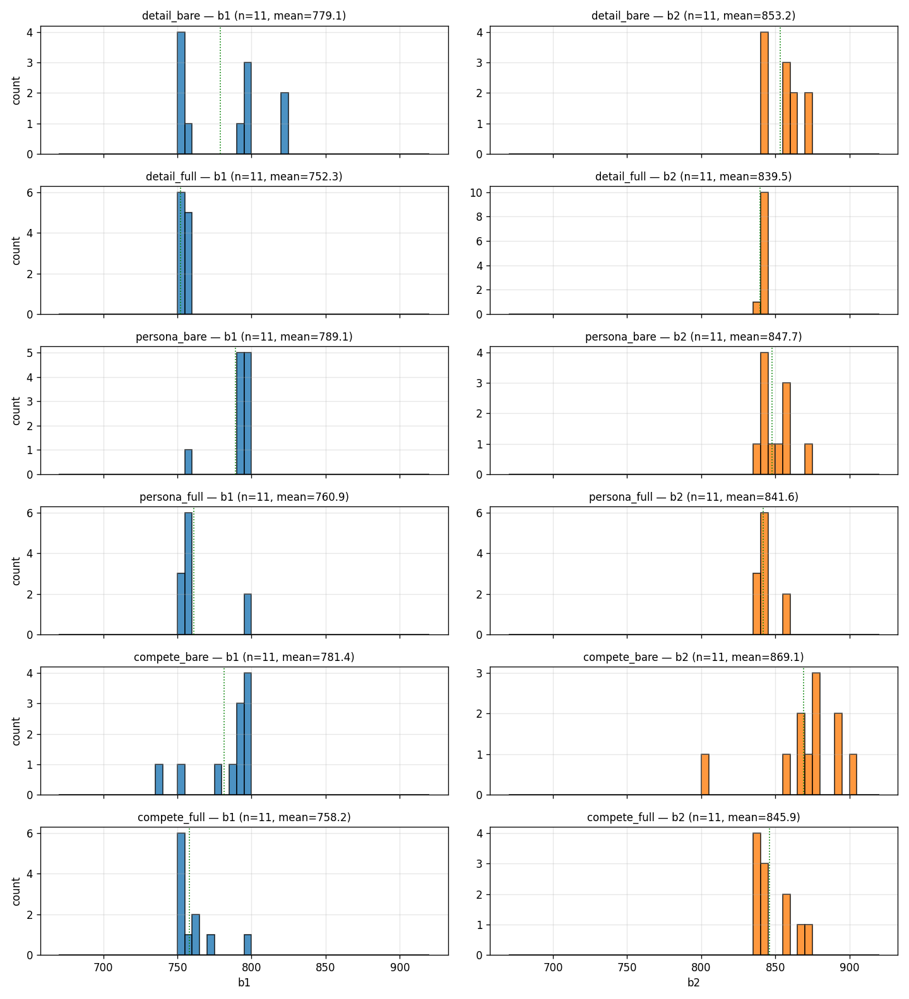

Using this, it seemed like a safe strategy to bid $(b_1, b_2) = (756, 852)$. The actual average $b_2$ turnmed out to be 859. We made 74,710 XIRECS, ranking 265th.

 

## Round 4

Round 4 manual introduced:
- spot trading,
- exotic derivatives,
- chooser options,
- binaries,
- knockouts,
- and CVaR optimization.

We built:
- Black-Scholes models for vanillas,
- Monte Carlo pricers for exotics,
- and CVaR optimization routines.

The biggest lesson:
> naive expected value optimization produced absurd tail risk.

We therefore optimized:
- conditional value-at-risk,
- rather than pure mean return.

 

## Round 5

Round 5 manual was news trading.

The strongest idea here was comparing:
- previous years’ news,
- to current year assets,
- and mapping similar products across competitions.

The intuition:
- similar narratives likely produced similar magnitude moves.

We are still unsure how much edge this truly provided,
but it was one of the cleaner structural approaches available.

 

# FAQ

## What mattered most?

Probably:
- structural understanding,
- skepticism,
- and avoiding overfitting.

Most strategies that looked magical initially ended up collapsing under proper testing.

The competition constantly rewarded:
- robustness,
- simplicity,
- and critical thinking.

 

## Did machine learning matter?

Less than expected.

ML was useful mainly for:
- hypothesis generation,
- exploratory analysis,
- and occasionally filtering signals.

Most final production strategies were surprisingly simple.

 

## Was preparation important?

Extremely.

A huge portion of our success came from:
- building infrastructure beforehand,
- studying previous writeups,
- understanding market microstructure,
- and creating fast research workflows.

Without that preparation, the round timers become overwhelming very quickly.

 

# Conclusion

Throughout the competition, we tried to approach every product with the same philosophy:
- understand the generation process,
- test assumptions aggressively,
- avoid blind optimization,
- and prioritize robustness over elegance.

In our opinion, that mattered far more than any individual trick or model.

Prosperity is one of the rare competitions where:
- intuition,
- creativity,
- statistical thinking,
- engineering,
- and adaptability

all matter simultaneously.

That is also what makes it such a fantastic challenge.

We hope this writeup helps future participants:
- avoid some of our mistakes,
- develop stronger intuition,
- and continue pushing the competition forward.

Good luck next year :)

P.S. if you have any other questions, you can always dm us on linkedIn!
 
