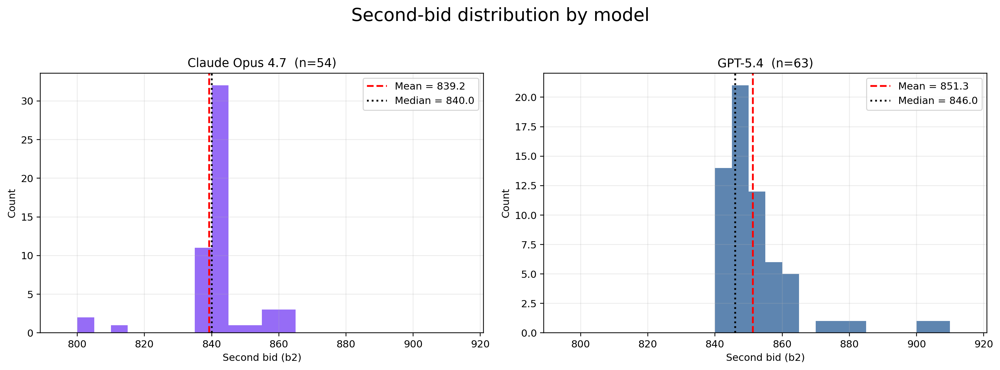
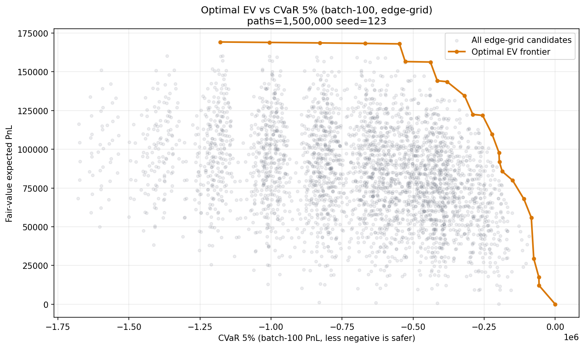
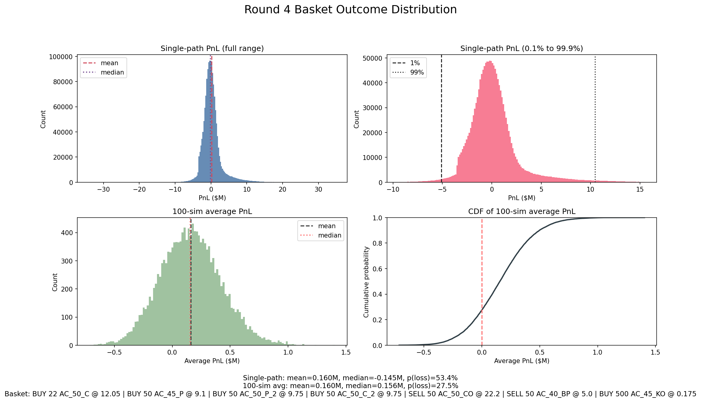

# Une Baguette Fromage 🥖🧀

This write-up shares the strategies, research, and infrastructure that brought us to **🏆 4th place globally, 🏆 1st place in Europe** out of 18,803 teams in **IMC Prosperity 4 (2026)**, a 5-round international quantitative trading competition with both algorithmic and manual challenges. Overall, our team was awarded **$3,500 prize money** for top performance and achieved a final PnL score of **1,386,318 XIREC**.

<table width="80%">
  <tbody>
    <tr>
      <td align="center" valign="top" width="200px">
        
         
        
<b><a href="https://www.linkedin.com/in/jasper-van-der-ende/">Jasper van der Ende</a></b>

      </td>
      <td align="center" valign="top" width="200px">
        
         
        
<b><a href="https://www.linkedin.com/in/teun-schuur-1b0b29270/">Teun Schuur</a></b>

      </td>
      <td align="center" valign="top" width="200px">
        
         
        
<b><a href="https://www.linkedin.com/in/thomas-stges/">Thomas St Ges</a></b>

      </td>
      <td align="center" valign="top" width="200px">
        
         
        
<b><a href="https://www.linkedin.com/in/guilhem-doat-25bb66356/">Guilhem Doat</a></b>

      </td>
      <td align="center" valign="top" width="200px">
        
         
        
<b><a href="https://www.linkedin.com/in/dylan-c-6164b5323/">Dylan Conrad</a></b>

      </td>
    </tr>
  </tbody>
</table>

 

As many top-performing teams from previous Prosperity iterations have done, we decided to publish this writeup to give back to the Prosperity community.

We believe Prosperity is one of the rare competitions where sharing approaches genuinely raises the bar for everyone. Every public writeup forces future participants — and IMC itself — to push the limits further. Previous teams’ writeups helped us tremendously during the competition, so this document is our attempt to continue that cycle.

That said, getting to the top was not just about getting lucky and finding a magical strategy. We systematically tested every possibility we could think of, building our own understanding of the markets IMC had created instead of blindly applying textbook techniques.

Our goal with this document is not only to explain what worked, but also:
- how we approached research,
- how we validated ideas,
- how we avoided overfitting,
- and how we navigated an absurdly large search space under extreme time pressure.

 

## IMC Prosperity 4

IMC Prosperity 4 (2026) was a global quantitative trading competition consisting of 5 rounds across 2 weeks, with more than 30,000 students participating worldwide across almost 19,000 teams.

Participants developed trading algorithms to maximize profits against simulated markets for securities and commodities populated by various bots and hidden behaviors. Over the course of the competition, new products and mechanics were gradually introduced, forcing teams to constantly adapt their strategies and research process. Cumulatively, there were a total of 64 products traded over the course of the competition, with 50 introduced and active during the final round alone.

The competition touched many areas of quantitative trading and research:
- market making,
- statistical arbitrage,
- microstructure analysis,
- derivatives pricing,
- signal extraction,
- event-based trading,
- optimization,
- simulation,
- and game theory.

Each round also featured a separate manual challenge involving probabilistic reasoning, auctions, optimization, or strategic decision-making.

 

## Structural Overview

- [Tools & Infrastructure](#tools--infrastructure)
- [Wall Mid](#wall-mid)
- [On Vibe Coding](#on-vibe-coding)
- [Algorithmic Challenge](#algorithmic-challenge)
  - [Round 1](#round-1)
  - [Round 2](#round-2)
  - [Round 3](#round-3)
  - [Round 4](#round-4)
  - [Round 5](#round-5)
- [Manual Challenge](#manual-challenge)
  - [Round 1](#manual-round-1)
  - [Round 2](#manual-round-2)
  - [Round 3](#manual-round-3)
  - [Round 4](#manual-round-4)
  - [Round 5](#manual-round-5)
- [FAQ](#faq)

 

# Tools & Infrastructure

One of our earliest decisions was to make sure we did not rely solely on the native IMC tester.

Instead, we forked and heavily extended Jmerle’s backtester and visualizer for Prosperity 4.

Having a proper local environment was absolutely essential for us, especially because the round timers were brutal:
- 72 hours per round during qualifications
- 48 hours per round during finals

This leaves very little room for slow feedback loops.

The backtester gave us:
- local exchange simulation,
- position limits,
- fair value updates,
- trader replay,
- and rapid parameter testing

without needing to constantly submit to the official platform.

Being able to run hundreds of local simulations in minutes instead of waiting on the website queue was a massive advantage.

 

## Dashboard

On top of the core backtester, we built a heavily customized dashboard environment.

<table>
<tr valign="top">
<td width="100%" align="center">
  <strong>Figure 1: Dashboard Overview</strong>
</td>
</tr>

<tr valign="top">
<td width="100%" align="center">
  
</td>
</tr>

<tr valign="top">
<td width="100%" align="center">
  <strong>Figure 2: Analyzer Overview</strong>
</td>
</tr>

<tr valign="top">
<td width="100%" align="center">
  
</td>
</tr>

<tr valign="top">
<td width="100%" align="center">
  <em>Overview of the custom visualization dashboard used throughout the competition.</em>
</td>
</tr>
</table>

Key additions included:
- Price and mid-price charts with fair value overlays
- Volume profiles per product and timestamp
- PnL attribution broken down per product
- Visualization of counterparty trades
- Position tracking over time
- Dynamic graphing support for arbitrary indicators

The dashboard became one of our most important research tools throughout the competition.

We used it constantly for:
- validating hypotheses,
- spotting hidden behaviors,
- understanding microstructure,
- and debugging strategies.

 

## Jupyter Workflow

Alongside the dashboard, we relied heavily on Jupyter notebooks.

The notebooks acted as our scratchpad for:
- exploratory analysis,
- signal research,
- residual analysis,
- autocorrelation testing,
- parameter optimization,
- and visualization.

We found the separation between:
- notebooks for fast experimentation,
- and the dashboard for validation

to be extremely effective.

 

## Git Workflow

We also maintained a lightweight git branching structure.

Each product family had its own branch, while the main branch only received tested competition-ready code.

This prevented the classic Prosperity failure mode:
fixing one product at 3AM and accidentally breaking another one.

Version discipline ended up saving us repeatedly during later rounds.

 

## A Note on Backtester Limitations

One thing we want to stress:

Local backtesting has real structural limitations.

Ignoring them leads directly to overfit strategies that look incredible locally and collapse live.

The most important limitations we encountered were:
- No market impact
- Simplified orderbook dynamics
- Imperfect bot behavior replication

Our philosophy became:

> Use the backtester as a filter, not as ground truth.

If a strategy failed locally, we discarded it.

If it passed locally, we still questioned it aggressively before trusting it live.

Strategies with absurdly good backtests were usually overfit.

 

# Wall Mid

One of the most important concepts throughout the competition was what we called the **Wall Mid**, described by the IMC Prosperity 3 second-ranking team the [Frankfurt Hedgehogs](https://github.com/TimoDiehm/imc-prosperity-3).

The standard midpoint between best bid and best ask was often a terrible estimate of actual fair value.

This was because:
- bots aggressively overbid,
- undercutting constantly occurred,
- and top-of-book prices were noisy.

During testing on the official Prosperity platform, it became possible to indirectly infer the underlying fair value through unrealized PnL changes.

Buying or selling tiny amounts and observing resulting PnL changes gave clues about where the simulator itself considered fair value to be.

We found that the best estimate consistently came from large persistent liquidity walls deeper in the book.

These walls:
- remained stable,
- appeared highly informed,
- and often anchored around the simulator’s internal fair value.

So instead of using the naive midpoint, we:
1. identified dominant liquidity walls,
2. extracted bid and ask wall prices,
3. and took the midpoint between those levels.

This produced a significantly cleaner and more predictive estimate of fair value.

<table>
<tr valign="top">
<td width="100%" align="center">
  <strong>Figure 3: Wall Mid vs Raw Mid (Ash-Coated Osmium)</strong>
</td>
</tr>

<tr valign="top">
<td width="100%" align="center">
  
</td>
</tr>

<tr valign="top">
<td width="100%" align="center">
  <em>Comparison between noisy top-of-book midpoint and Wall Mid estimation.</em>
</td>
</tr>
</table>

 

# On Vibe Coding

We want to be honest about something that rarely makes it into writeups:

A significant portion of our tooling and research was built through what the community now calls **vibe coding**.

Fast, iterative, heavily AI-assisted development became one of the most important tools during the competition.

In a competition like Prosperity, you simply cannot afford to spend:
- six hours architecting perfect pipelines,
- writing elegant abstractions,
- or polishing infrastructure

when there are only 30 hours left in a round.

The correct move is often:
1. get something working quickly,
2. validate the idea,
3. then decide whether it deserves cleanup.

Concretely, this included:
- rapidly prototyping parsers,
- building one-off scanners,
- dynamically extending the dashboard,
- generating parameter sweep harnesses,
- and quickly validating statistical ideas.

The key discipline is knowing:
- when AI-generated code is acceptable,
- and when every line must be manually verified.

We kept a strict separation:
- exploratory tooling could be messy,
- production strategy code had to be understood completely.

Used correctly, vibe coding became an enormous force multiplier.

 

# Algorithmic Challenge

## Round 1

Round 1 introduced two products, both with max position 80.

### OSMIUM

The first product introduced was ASH_OSMIUM_OSMIUM, which we simply called OSMIUM.

OSMIUM was essentially:
- large spread,
- slowly mean reverting,
- occasionally crossing the Wall Mid,
- and highly suitable for market making.

After a quick Augmented Dickey-Fuller test, we confirmed that it was stationary around approximately 10,000, with p-value below 0.0005.

<table>
<tr valign="top">
<td width="100%" align="center">
  <strong>Figure 4: OSMIUM Orderbook</strong>
</td>
</tr>

<tr valign="top">
<td width="100%" align="center">
  
</td>
</tr>

<tr valign="top">
<td width="100%" align="center">
  <em>Typical OSMIUM orderbook behavior.</em>
</td>
</tr>
</table>

#### Empty Book Behavior

One of the first major discoveries was what happened when one side of the book became empty; When quoting on an empty side, sometimes a taker showed up that took your quote.

This happened roughly 8% of the time, on both products.

We tested increasingly aggressive quotes and discovered that a spread of exactly 100 around previous Wall Mid maximized profitability while still getting filled.

Using rough averages:
- trade frequency around 0.047,
- average trade size around 5,
- and captured spread around 100,

this gave about 23 expected PnL per empty-side event.

Over a full day, that translated into roughly 18.6k expected PnL for OSMIUM alone.

#### Final Strategy

Our OSMIUM strategy became a relatively standard Avellaneda-Stoikov style market maker with inventory management.

The reserve price shifted linearly with inventory:

S_r = 10000 - γQ

where:
- Q = inventory
- γ controlled inventory pull strength

We found γ = 1/12 to perform best.

The strategy:
- penny quoted around fair value,
- crossed spread when sufficiently favorable,
- and widened aggressively when one side became empty.

More concretely, we used an inventory-adjusted reserve price of the form

S_r = 10000 - gamma * Q

with gamma = 1/12, so the adjustment at max inventory was roughly 6.7.

When one side of the order book disappeared, we did not use the full width of 100 in production.

Instead, we quoted a spread of 98 around Wall Mid as a small safety margin against Wall Mid estimation error.

 

### INTARIAN_PEPPER_ROOT

The second asset was INTARIAN_PEPPER_ROOT, which we called PEPPER_ROOT.

Unlike OSMIUM, it increased almost deterministically by 0.1 every tick.

<table>
<tr valign="top">
<td width="100%" align="center">
  <strong>Figure 5: PEPPER_ROOT Orderbook</strong>
</td>
</tr>

<tr valign="top">
<td width="100%" align="center">
  
</td>
</tr>

<tr valign="top">
<td width="100%" align="center">
  <em>Typical PEPPER_ROOT orderbook behavior.</em>
</td>
</tr>
</table>

The obvious strategy was:
> buy and hold

However, the average spread was around 14, which was too attractive to ignore for market making.

The problem was that market making a deterministically drifting product is less trivial than it first appears.

#### Dynamic Programming Model

For Round 1, we modeled PEPPER_ROOT with dynamic programming.

The idea was to compute the optimal expected future value for every:
- time step,
- inventory level from -80 to 80,
- spread state,
- and trade-size realization.

The model used:
- deterministic drift of 0.1 per tick,
- per-side trade rate around 0.017,
- and an empirical trade-size distribution centered around roughly 5.14.

This produced bid and ask thresholds describing the worst prices at which quoting was still positive EV.

Rather than putting the full Bellman derivation inline, the compiled formulation we used is shown below.

<table>
<tr valign="top">
<td width="100%" align="center">
  <strong>Figure 6: PEPPER_ROOT Bellman Compilation</strong>
</td>
</tr>

<tr valign="top">
<td width="100%" align="center">
  
</td>
</tr>

<tr valign="top">
<td width="100%" align="center">
  <em>Bellman setup used to derive PEPPER_ROOT quote thresholds.</em>
</td>
</tr>
</table>

Once we had the value function, the strategy became simple:
- penny the best bid or ask when the corresponding threshold allowed it,
- market take when the threshold crossed the opposite best quote,
- and use the same empty-book quote of spread 98 when one side disappeared.

This first approach did not work quite as well as we hoped.

So instead of using the raw thresholds directly, we introduced:
- a bid adjustment parameter,
- an ask adjustment parameter,
- and optimized both with a grid search over realized PnL.

The best values were:
- bid adjustment = 4,
- ask adjustment = 5.

This was clearly not perfect, and we later fixed the modeling issue properly in Round 2. But it still outperformed pure buy-and-hold.

Round 1 closed with a cumulative score of **207,308 XIREC**, good for **🏆 8th globally overall**. On the pure algorithmic leaderboard, we scored **119,313 XIREC** and finished **🏆 8th algorithmic**.

 

## Round 2

### Extra Market Access

Round 2 introduced the ability to bid for “extra market access.”

If your bid was above the median submitted bid, you received access to an expanded market feed.

The catch was that this "extra access" only meant:
- roughly 20% more quotes,
- but not 20% more trades.

This was an intentional red herring.

Why would a rational team want to PAY for more market maker competition, let alone have more market maker competition at all (even if for free)? Under such a scenario, the spread on an asset at any given time could potentially decrease with more competition (it will certainly never increase), thus we would expect to earn less PnL from market making overall since our fills would be closer to the fair value. Furthermore, empty order book sides could now potentially have quotes present under this increased market access, thus also impairing our "hidden taker" quoting strategy that reliably printed PnL in round 1. The only potential upside to this was more taking opportunities for us when a maker crossed the fair value; however this was calculated to be an inconsequential upside compared to the massive PnL haircut we would receive on our other trading activities.

The obvious answer became:
> bid zero.

Though, we initially wanted to bid negative infinity since we expected other rational participants to bid 0 or lower as well (we wanted to avoid extra market access no matter what; and as an added bonus, if more than 50% of players thought like us and also bid negative infinity, we thought we could all win the round with infinite PnL). However, after we inquired about this to the IMC Prosperity team, it was later publicly clarified that negative bids would default to 0.

Yet, following the round, the IMC Prosperity team announced that the median bid among all participants was 50. So while we fortunately did not get extra market access as we had desired, the majority of participants did not identify that this was actually a net negative and still chose to bid a positive value.

 

### Strategy Changes

The OSMIUM strategy itself did not materially change from Round 1.

However, Round 2 exposed a weakness in our implementation.

We had hard-coded the fair value at 10,000, and that anchor did not hold perfectly on this round's data.

As a result, we spent too much time pinned at max inventory, which weakened both:
- the mean reversion component,
- and the market making component.

Looking back, we should have added a fail-safe:
- if inventory stayed maxed for long enough,
- we should have gradually shifted our assumed fair value toward the observed market mid.

There was not any hint that this could've happened though, since in the complete historical data for OSMIUM, it's fair value was always 10,000
PEPPER_ROOT changed more meaningfully.

In Round 1, our dynamic programming model still relied on "adjustment" parameters to compensate for hidden modeling errors.

We did not like that.

So for Round 2 we fixed the DP formulation itself by explicitly incorporating:
- spread distributions,
- and the arrival of large-spread takers.

This produced much cleaner bid and ask thresholds and removed the need for the earlier bid/ask adjustment parameters.

Round 2 closed with a cumulative score of **528,132 XIREC**, good for **🏆 4th globally overall**. On the pure algorithmic leaderboard, we scored **102,954 XIREC** and finished **🏆 14th algorithmic**. The OSMIUM underperformance still made it clear that even a good structural model needed defensive safeguards.

 

### Recurring Takers Research

During the intermission period following Round 2, we performed broader research into generalized alpha sources.

By that point, the admins had already announced that OSMIUM and PEPPER_ROOT would not carry forward into the remaining Phase 2 rounds.

So the goal of this research was not to squeeze the last bit of PnL out of those products.

The goal was to identify product-agnostic alpha sources that might generalize into later rounds.

This led to one of our most interesting discoveries.

Across many instances on both OSMIUM and PEPPER_ROOT, takers reappeared:
- at identical timestamps,
- with identical side,
- and with identical size,
- on consecutive days.

We eventually identified the underlying mechanism:

If a taker appeared at:
- timestamp t
- on day d

then there was a very high probability the same taker appeared again:
- at timestamp t
- on day d+1

The effect appeared to be strongly one-day dependent:
- day d takers had strong predictive power for day d+1,
- but much less direct predictive power for day d+2 unless the same event also appeared on day d+1.

So we modeled these transitions as a Markov-style recurrence process across products and rounds.

<table>
<tr valign="top">
<td width="50%" align="center">
  <strong>Figure 7: OSMIUM Taker Recurrence</strong>
</td>
<td width="50%" align="center">
  <strong>Figure 8: PEPPER_ROOT Taker Recurrence</strong>
</td>
</tr>

<tr valign="top">
<td width="50%" align="center">
  
</td>
<td width="50%" align="center">
  
</td>
</tr>

<tr valign="top">
<td width="100%" colspan="2" align="center">
  <em>Recurring taker probabilities across consecutive days for OSMIUM and PEPPER_ROOT.</em>
</td>
</tr>
</table>

The round-to-round difference was especially noticeable:
- this recurring-actor behavior was very strong in Round 2,
- and virtually non-existent in Round 1.

For OSMIUM:
- takers with size ≥ 7
- repeated with ~97.7% probability.

#### Monetizing This

At first glance, this does not obviously look monetizable.

Knowing when a taker will arrive is only useful if the matching engine lets you reshape the book first.

That is exactly what the Prosperity simulator allowed.

If we predicted a large taker would arrive:
1. we cleared all existing liquidity,
2. leaving one side empty,
3. then placed an extreme quote,
4. which the taker would often immediately hit.

This effectively recreated hidden-taker opportunities.

Of course, this came with a tradeoff:
- clearing the book imposed an immediate adverse execution cost,
- so the expected taker fill had to be strong enough to justify it.

Operationally, the decision rule was just an expected-value filter.

If:
- c_clear = immediate cost of clearing visible liquidity
- p_repeat = probability that the recurring taker actually reappears
- q = expected taker size
- edge = expected edge captured per unit when our extreme quote gets hit

then we only triggered the setup when

> p_repeat * q * edge > c_clear

usually with an extra buffer for inventory risk and model error.

So the setup was not "predict a taker, always clear the book."
It was "predict a taker, estimate whether the expected refill value exceeds the certain cost of manufacturing the empty side, and only fire when that inequality is comfortably positive."

For large OSMIUM takers in Round 2, the recurrence probability was high enough that this inequality often held, which made the strategy meaningfully monetizable rather than just statistically interesting.

 

## Round 3

### HYDROGEL_PACK

HYDROGEL_PACK behaved similarly to OSMIUM:
- slowly mean reverting,
- average spread around 16,
- and consistently liquid.

The main difference from OSMIUM was that HYDROGEL_PACK was somewhat more volatile, while never exhibiting the empty-book behavior that made OSMIUM so profitable.

That made the product relatively straightforward compared to what came next.

<table>
<tr valign="top">
<td width="100%" align="center">
  <strong>Figure 9: HYDROGEL_PACK Orderbook</strong>
</td>
</tr>

<tr valign="top">
<td width="100%" align="center">
  
</td>
</tr>

<tr valign="top">
<td width="100%" align="center">
  <em>Typical HYDROGEL_PACK orderbook behavior.</em>
</td>
</tr>
</table>

 

### VELVETFRUIT_EXTRACT

VELVETFRUIT_EXTRACT was also mean reverting, but with a much tighter spread of around 5 and significantly higher volatility.

A simple Avellaneda-Stoikov market maker no longer worked well due to:
- tighter spreads,
- larger jumps,
- and higher short-term volatility.

<table>
<tr valign="top">
<td width="100%" align="center">
  <strong>Figure 10: VELVETFRUIT_EXTRACT Orderbook</strong>
</td>
</tr>

<tr valign="top">
<td width="100%" align="center">
  
</td>
</tr>

<tr valign="top">
<td width="100%" align="center">
  <em>Typical VELVETFRUIT_EXTRACT orderbook behavior.</em>
</td>
</tr>
</table>

We instead modeled the product as an Ornstein-Uhlenbeck process.

Estimated parameters:
- mean ≈ 5250
- theta ≈ 0.15
- sigma ≈ 9.8

This implied a long-term OU volatility of approximately

Omega = sigma / sqrt(2 * theta) ≈ 18

This became our primary threshold.

#### Final Strategy

The resulting strategy became extremely simple:
- buy below 5232
- sell above 5268

Despite its simplicity, this performed surprisingly well.

 

### Options

Round 3 also introduced 10 call options written on VELVETFRUIT_EXTRACT.

Initially, we expected IV surface trading opportunities similar to Prosperity 3.

However, analysis revealed:
- implied volatility remained almost constant,
- per option,
- throughout each day.

This completely destroyed the standard 'fit parabola → trade IV mispricing' approach.

<table>
<tr valign="top">
<td width="100%" align="center">
  <strong>Figure 11: IV smile</strong>
</td>
</tr>

<tr valign="top">
<td width="100%" align="center">
  
</td>
</tr>
</table>

Instead, we concluded the options were essentially priced fairly.

Therefore:
- the options themselves contained little standalone alpha,
- but they could still be used to leverage mean reversion exposure on the underlying.

The resulting thresholds were computed through:
- Black-Scholes pricing,
- using each option's average IV for that day,
- and evaluating the underlying at the OU thresholds around 5250 ± 18.

We also briefly investigated whether certain bot trades in lower strikes such as VEV_4000 near rolling extrema were predictive of reversals.

In retrospect, this was mostly an artifact of the underlying itself being mean reverting rather than a genuinely distinct signal.

Round 3 closed with a cumulative score of **373,440 XIREC**, good for **🏆 3rd globally overall**. On the pure algorithmic leaderboard, we scored **298,730 XIREC** and finished **🏆 3rd algorithmic**.

 

## Round 4

Round 4 largely kept the Round 3 product set, but added trader Marks.

### Monte Carlo Option Thresholds

This round pushed us to improve our voucher trading substantially.

We built a Monte Carlo framework that:
- simulated future VELVETFRUIT_EXTRACT paths using our Ornstein-Uhlenbeck model
- priced each voucher along those paths with Black-Scholes
- kept a fixed implied volatility per voucher

This gave us a much more realistic estimate of the distribution of future option values than using a single OU threshold on the underlying.

The main reason this mattered was **Theta**.

Even if the underlying reverted in the expected direction, the vouchers were constantly losing time value.

So the correct buy and sell thresholds could not be based only on expected terminal value:
- they also had to compensate for time decay,
- especially for the more out-of-the-money vouchers.

We therefore optimized thresholds directly on simulated PnL outcomes.

Our final objective was:
> E[PnL] - 0.25 Std(PnL)

rather than maximizing Sharpe ratio.

This deliberately chose a more aggressive point on the risk-return frontier:
- higher expected PnL,
- but also materially higher variance.

In hindsight, this likely explains why Round 4 went worse for us than the previous round.

We do not think the approach was fundamentally wrong.

It was simply more exposed to bad short-run realization.

### Mark Analysis

Most Marks turned out to be far less informative than we initially hoped.

There was a lot of temptation to build broad Mark-conditioned strategies, but for all Marks the signal was either too weak, too unstable, or too hard to monetize in real time.

So, no Mark-based strategies made it into the final submission, and we instead focused on improving our existing market making and option trading strategies.

Round 4 closed with a cumulative score of **602,022 XIREC**, good for **🏆 11th globally overall**. On the pure algorithmic leaderboard, we scored **191,652 XIREC** and finished **🏆 10th algorithmic**.

 

## Round 5

What made Round 5 incredibly complex was not necessarily the trading itself, but figuring out what actually mattered inside an absurdly large search space.

The surprise jump to 50 assets completely changed the way we approached research.

Previous rounds naturally pushed teams toward understanding a handful of products deeply.

Round 5 instead tempted everyone into building giant correlation matrices and searching for structure everywhere at once.

Initially, we did too.

We spent a large part of the first day building scanners and validators for:
- cross-family correlations,
- basket residuals,
- rolling z-score deviations,
- cointegration tests,
- lead-lag relationships,
- and microstructure imbalance signals.

And to be honest, at first it looked like we had found basically unlimited alpha.

Entire families appeared tightly linked.
Baskets showed extreme mean reversion.
Products seemed to predict each other with almost suspicious precision.
Dozens of plots looked beautiful, and many strategies produced extremely strong in-sample backtests.

That made us more skeptical rather than less.

Our biggest risk at that point was convincing ourselves that the market was far more structured than it really was.

So we forced proper out-of-sample validation:
- fit on two days,
- test on the third.

The result was a disaster.

Relationships that looked statistically convincing immediately collapsed:
- residuals became non-stationary,
- hedge ratios changed sign,
- correlations weakened or inverted,
- and most cross-family pairs that had looked like statistical candy turned into rotten fruit instantly.

We think this is also why there were so many misleading "huge alpha" claims in Discord.

If you searched hard enough, it really was possible to find absurdly profitable backtests.

The hard part was finding relationships that actually survived out-of-sample.

### What Survived

In the end, the live strategy was much simpler than our research notebook graveyard suggested.

The backbone was broad market making.

Just making markets across many assets was already highly profitable, especially because much of the taker flow was effectively shared across products.

If we got filled, we often got filled in many assets at once, which reduced effective exposure at the portfolio level because the large basket of products was much less volatile than any single name.

For most products, that meant simply quoting aggressively inside the spread.

For a couple of families such as TRANSLATORS and GALAXY_SOUNDS, we used a slightly better Wall-Mid-style market maker with inventory skew.

On top of that baseline, only a few alpha layers survived the cut.

The family-level PnL attribution after the round reinforced that story.

The clearest winners were:
- OXYGEN_SHAKES at about +669k
- PEBBLES at about +22.4k
- SNACKPACKS at about +19.1k
- TRANSLATORS at about +11.7k
- PANELS at about +9.3k
- GALAXY_SOUNDS at about +5.5k

Those were mostly families where either broad market making alone was already strong, or where the extra structure we kept live was at least directionally helpful.

In particular, OXYGEN_SHAKES were actually our main PnL source, which the DaFuck alpha discussed below largely explains.

The weak spots were just as informative:
- MICROCHIPS lost about 26.8k,
- SLEEP_PODS lost about 14.0k,
- UV_VISORS lost about 7.0k,
- and ROBOTS lost about 4.3k.

So even though some of those families had research ideas we found statistically interesting, live attribution made it clear that not all of them translated into robust production alpha.

### Residual Baskets

Most of the grand cross-family structure was thrown out.

Only a handful of residual baskets were robust enough to keep live.

The final submission traded mean reversion on a small set of family combinations:
- MICROCHIPS,
- SLEEP_PODS,
- SNACKPACKS,
- and one DOMESTIC_ROBOTS basket.

These were implemented as weighted basket residuals with fixed mean and volatility thresholds, plus a killswitch for extreme dislocations.

This was a much narrower version of our original vision for the round.

The live attribution was mixed.

Some families clearly did not justify the complexity:
- MICROCHIPS finished deeply negative,
- and SLEEP_PODS also lost meaningfully.

That is exactly the kind of result we had been worried about when so many residual relationships collapsed out-of-sample.

SNACKPACKS were more nuanced.

The return structure there was genuinely interesting:
- VANILLA and CHOCOLATE were about -0.92 correlated,
- RASPBERRY and STRAWBERRY were negatively correlated with each other,
- and the RASPBERRY-plus-STRAWBERRY basket showed structure against PISTACHIO.

<table>
<tr valign="top">
<td width="100%" align="center">
  <strong>Figure 12: SNACKPACK Correlation Structure</strong>
</td>
</tr>

<tr valign="top">
<td width="100%" align="center">
  
</td>
</tr>

<tr valign="top">
<td width="100%" align="center">
  <em>Correlation structure inside the SNACKPACK family.</em>
</td>
</tr>
</table>

We did try basket trading and arbitrage around this.

However, it did not end up being nearly as profitable as the cleanest live structures.

So although SNACKPACKS still finished strongly positive at about +19.1k, that was more a validation of the simpler final structure than of an elaborate family-arbitrage thesis.

### DaFuck Alpha

The cleanest standalone microstructure signal was what we internally called the **DaFuck alpha**.

<table>
<tr valign="top">
<td width="100%" align="center">
  <strong>Figure 13: DaFuck Alpha</strong>
</td>
</tr>

<tr valign="top">
<td width="100%" align="center">
  
</td>
</tr>

<tr valign="top">
<td width="100%" align="center">
  <em>Example of the short-horizon jump-and-revert behavior we exploited in Round 5.</em>
</td>
</tr>
</table>

This pattern appeared on random products at random times, but in our live results the clearest and most important manifestation was OXYGEN_SHAKE_CHOCOLATE.

What happened was that price would jump to the nearest round 100 level, such as 10.3k or 10.4k, and once it jumped there, the probability of quickly jumping back was far above 50%.

So in practice it behaved like a very short-horizon mean reversion signal.

The implementation was correspondingly simple:
- for each product, detect a sufficiently large jump after a few stable ticks,
- assume the move is likely to revert,
- and immediately take liquidity on the opposite side.

This was one of the easiest real alphas to identify and monetize.

In hindsight, this also explains why OXYGEN_SHAKES ended up as our biggest winning family.

By contrast, ROBOTS still finished slightly negative overall at about -4.3k, so although the same effect did show up there in the historical data, it was not the main source of realized PnL.

### UV_VISORS

Our initial lead-lag research produced a lot of false positives, so by late Round 5 we were already suspicious of almost every such result.

Then, in the final hours, we found one lead-lag structure in UV_VISORS that actually looked real.

The effect itself was modest: certain visor products appeared to turn, and roughly half a day later another visor product tended to follow,

That was not the kind of signal you build a huge standalone strategy around with 90 minutes left.

So we implemented the smallest thing that could plausibly monetize it: a regime overlay.
It either added or subtracted 1 tick from fair value on a couple of specific leader-lagger pairs.

This caused a lot of stress because it was found very late, but it did make it into the final bot.

The final attribution there was mildly negative, with UV_VISORS ending around -7.0k.

So we still think the structure was real, but the live implementation was too small and too late to become a major source of PnL.

### PEBBLES

PEBBLES turned out not to be one magical alpha with a clean verbal explanation.

Looking at our final submission, the live PEBBLES strategy was really a synthetic family-pricing model with a few extra lagged signals layered on top.

The core fair value assumption was that the five PEBBLES products approximately summed to a stable anchor around 50,000.

So for any one product, we priced it synthetically as:
- 50,000
- minus the observed prices of the other four sizes.

That gave a synthetic fair value for each pebble size, after which we:
- applied inventory skew,
- quoted around that reservation price,
- and took liquidity when the observed market was sufficiently far away.

On top of that, we added a few cross-size lag rules, for example:
- PEBBLES_XS reacting to prior moves in PEBBLES_XL and PEBBLES_L,
- PEBBLES_S reacting to prior moves in PEBBLES_M and PEBBLES_XS,
- and PEBBLES_XL reacting to prior moves in PEBBLES_L.

Some pebble sizes were therefore mostly plain synthetic market making, while others had a directional regime overlay from those lagged triggers.

So for our final alpha:
> the PEBBLES alpha in our final bot was a synthetic basket fair-value model with a small amount of hand-tuned intra-family lead-lag logic, not one single elegant standalone edge.

Attribution supports that interpretation quite well: PEBBLES ended up as our strongest Round 5 family at about +22.4k.

### Final Strategy Philosophy

In the end:
- we discarded most cross-family complexity,
- kept only the most robust relationships,
- relied heavily on broad market making,
- and layered only a small number of specific alphas on top.

Ironically, a few components we still suspected might be slightly overfit ended up live anyway, simply because at some point you have to stop researching and submit.

Round 5 closed with a cumulative score of **1,386,318 XIREC**, good for **🏆 4th globally overall**. On the pure algorithmic leaderboard, we scored **684,923 XIREC** and finished **🏆 4th algorithmic**.

 

# Manual Challenge

## Round 1: An Intarian Welcome 

**The challenge:**

The first manual round was a one-shot auction optimization problem on two products: **DRYLAND_FLAX** and **EMBER_MUSHROOM**. For each product, we submitted a single limit order consisting of a price and quantity after all other orders were already fixed.

The exchange then selected a single clearing price that:
- maximized traded volume,
- and, in the event of a tie, chose the higher price.

All trades executed at the clearing price, and because we submitted last, we were always last in queue at any price level we joined. Any inventory we bought was then immediately sold back at a fixed price:
- **DRYLAND_FLAX:** 30 per unit, no fee
- **EMBER_MUSHROOM:** 20 per unit, with a 0.10 fee per unit traded

**Our strategy**

The key insight was that we paid the **clearing price**, not our own bid. This meant bid price mattered mainly through its effect on queue position and on whether our order changed the clearing-price regime. Quantity mattered because it could push the auction into a new tie, which would then be resolved upward by the higher-price tie-break rule.

To solve this, we built an exact in-house auction simulator and brute-forced every feasible `(bid_price, quantity)` pair. For each candidate, we:
- constructed the cumulative demand and supply curves at every price level,
- computed the clearing price under the official auction rule,
- allocated fills using price priority and then time priority,
- and calculated profit as `fill × (buyback price − clearing price − fee)`.

This turned the problem into a clean optimization over discrete clearing-price transitions. In both products, the optimum ended up sitting exactly one unit below the quantity level that would have pushed the auction into the next, less profitable clearing-price regime.

### **DRYLAND_FLAX**

For DRYLAND_FLAX, the optimal order was **9,999 units at price 30**, producing a profit of **9,999**.

Without our order, the auction cleared at `28` with `40,000` units traded. Adding `9,999` units of demand at `30` caused price `29` to tie for maximum traded volume at `40,000`, so the exchange selected `29` by the higher-price tie-break rule. This left us with a margin of `1` per unit.

At `10,000` units, price `30` also tied for maximum volume, so the clearing price jumped to `30`, eliminating all profit. The optimum therefore sat exactly one unit below that transition.

### **EMBER_MUSHROOM**

For EMBER_MUSHROOM, the optimal order was **19,999 units at price 20**, producing a profit of **77,996.10**.

The baseline auction cleared at `15` with `86,000` units traded. Adding `19,999` units of demand pushed price `16` up to `91,000` traded, making it the unique best clearing level and leaving a margin of `3.90` per unit after fees.

At `20,000` units, price `17` also reached `91,000` traded, so the clearing price moved up again and profit dropped sharply. As with FLAX, the optimum sat just below the next clearing-price transition.

**Final submission**

- **DRYLAND_FLAX:** bid `30` for `9,999`
- **EMBER_MUSHROOM:** bid `20` for `19,999`

**Total profit: 87,995 XIREC**

This approach worked exactly as intended: we obtained the optimal submission for the challenge and finished **🏆 1st globally** on the manual leaderboard and **🏆 8th globally** overall for Round 1.

 

## Round 2: Invest & Expand

**The challenge:**

The second manual round was a one-shot budget allocation problem. We were given `50,000` XIREC to distribute across three pillars — **Research**, **Scale**, and **Speed** — with the goal of maximizing final PnL.

Unlike a standard static optimization problem, this challenge had a strategic component: while Research and Scale were deterministic functions of our own allocation, the value of Speed depended on how our choice ranked relative to the rest of the field. That turned the problem into a game-theoretic best-response exercise rather than a simple constrained maximization.

**Key mechanics**

- **Research** grew logarithmically from `0` to `200,000` as allocation increased from `0` to `100`.
- **Scale** grew linearly from `0` to `7`.
- **Speed** was rank-based across all teams:
  - highest Speed received a `0.9` multiplier,
  - lowest received `0.1`,
  - everyone in between was scaled linearly by rank,
  - equal allocations shared the same rank.
- Total allocation could not exceed `100%`.
- PnL = (Research × Scale × Speed) − Budget_Used

**Our strategy**

The core of this challenge was estimating the field’s Speed distribution. Once Speed was fixed, the Research/Scale optimization was relatively straightforward: because Research was logarithmic and Scale was linear, the best non-Speed split was stable and heavily favored Scale after a modest Research allocation. The real uncertainty came from the rank-based Speed multiplier.

To approximate the crowd, we made a simple but effective assumption: many teams would rely on their preferred LLM for an initial recommendation. Rather than hand-picking a single crowd guess, we treated model outputs as a noisy but useful proxy for how a large fraction of the field might approach the problem.

In practice, we used the official challenge description as a seed prompt and generated six prompt variants corresponding to different player archetypes. We then queried several models, primarily GPT and Claude, repeatedly through their APIs, collected the resulting allocations, and compiled them into CSVs. This gave us empirical crowd priors for likely Speed choices under different LLM assumptions.

<table>
<tr valign="top">
<td width="100%" align="center">
  <strong>Figure 14: Speed Allocation Distribution Across Various LLMs</strong>
</td>
</tr>

<tr valign="top">
<td width="100%" align="center">
  
</td>
</tr>
</table>

<table>
<tr valign="top">
<td width="100%" align="center">
  <strong>Figure 15: GPT-5.4 Speed Allocation Distribution</strong>
</td>
</tr>

<tr valign="top">
<td width="100%" align="center">
  
</td>
</tr>
</table>

We then fed these sampled crowd distributions into our in-house brute-force optimizer. For each candidate Speed value from `0` to `100`, the optimizer estimated the corresponding expected rank-based multiplier against the sampled field, then enumerated every feasible integer `(Research, Scale)` pair satisfying the budget constraint and selected the allocation with the highest expected PnL. In our final decision, we searched for stable optimal parameter "landscapes" and weighed GPT 5.4 and Claude Opus 4.7 distributions most heavily, since they were the flagship public chatbot models at the time.

**Final submission**

- **Research:** `15`
- **Scale:** `43`
- **Speed:** `42`

**Result**

This approach worked exceptionally well and generated us a PnL of **217,869 XIREC** for this manual challenge alone! As one of only a few teams to reach the optimal submission for this challenge, we finished **🏆 1st globally** in manual trading and **🏆 4th globally** overall for Phase 1 (Rounds 1 and 2).

 

## Round 3: The Celestial Gardeners' Guild

**The challenge:**

The third manual round was a two-bid pricing problem against a population of counterparties with unknown reserve prices. Each counterparty’s reserve price was uniformly distributed between `670` and `920` in increments of `5`, and any units we bought could be resold the next trading day for a fixed fair value of `920`.

At first glance this looked like a simple expected-value problem, but the second bid introduced a strategic layer. While the first bid depended only on the reserve-price distribution, the value of the second bid also depended on how it compared with the **average second bid submitted by the rest of the field**.

**Key mechanics**

- We could submit **two bids**, `b1` and `b2`, with `b1 < b2`.
- If a counterparty’s reserve price was below `b1`, we traded at `b1`.
- If the reserve price was between `b1` and `b2`, we traded at `b2`.
- If `b2` was **above the field’s average second bid**, that second-bid trade earned the full margin `920 - b2`.
- If `b2` was **below the field average**, the second-bid payoff was penalized by

$$
\left(\frac{920 - \text{avg}(b_2)}{920 - b_2}\right)^3
$$

That penalty made the problem highly asymmetric: being slightly too low on the second bid could hurt much more than being slightly too high.

**Our strategy**

We started by solving the single-agent version of the problem under the assumption that our second bid would not be penalized. That gave a useful baseline for how the two bids should relate to each other.

The key insight was that the two bids were **coupled**. The first bid could not be optimized independently of the second. If we write expected profit as the sum of profit from reserves filled at `b1` and profit from reserves filled only at `b2`, the unconstrained optimum implies a structure of the form:

- `b1` should sit roughly halfway between the lower bound `670` and `b2`
- the joint optimum lands near `(753, 837)`
- on the discrete grid, the best unpenalized pairs sit around `(751, 835)` or `(751, 840)`

That baseline already showed why a naive midpoint-style first bid was wrong: maximizing the first leg in isolation left meaningful expected profit on the table.

The harder part was estimating where the field would place its second bid. Just as in Round 2, we treated this as a crowd-modeling problem. We generated multiple prompt variants based on the challenge description, queried LLMs repeatedly through their APIs, and used the resulting bid samples as a proxy for how many teams might reason about the game. This gave us an empirical distribution for likely second bids rather than forcing us to rely on a single guess.

<table>
<tr valign="top">
<td width="100%" align="center">
  <strong>Figure 16: Claude Opus 4.7 vs GPT 5.4 Second Bid Distributions</strong>
</td>
</tr>

<tr valign="top">
<td width="100%" align="center">
  
</td>
</tr>
</table>

<table>
<tr valign="top">
<td width="100%" align="center">
  <strong>Figure 17: Claude Bid Distributions by Prompt Variant</strong>
</td>
</tr>

<tr valign="top">
<td width="100%" align="center">
  
</td>
</tr>
</table>

We then fed these estimated average second-bid distributions into our in-house brute-force optimizer and, as we did for round 2's manual challenge, searched for stable optimal parameter "landscapes" across estimated distributions, weighing flagship models much more heavily. For every feasible integer pair `(b1, b2)`, it computed expected profit under the official reserve-price distribution and applied the penalty whenever `b2` fell below the estimated crowd mean. That turned the problem into a best-response search over the full two-dimensional bid grid.

The main conclusion was that while the unpenalized optimum sat near the low-`840`s, the cubic downside for underbidding the crowd justified submitting a second bid **slightly above** our estimated field average. We therefore shifted upward from the pure single-agent optimum and chose a more defensive pair.

**Final submission**

- **First bid:** `756`
- **Second bid:** `852`

**Result**

The realized average second bid was `859`, so our second bid ended up slightly below the field. Even so, the submission performed reasonably well and earned us a PnL of **74,710 XIREC**, which placed us **🏆 3rd globally** overall for Round 3 (note: leaderboard progress was reset following Round 2 since these were now finals, so this was effectively completely fresh performance).

 

## Round 4: Vanilla Just Isn't Exotic Enough

**The challenge:**

The fourth manual round was a one-shot derivatives portfolio construction problem. We were given a menu of positions on **AETHER_CRYSTAL**: the underlying itself, vanilla calls and puts with 2-week and 3-week expiries, and several exotics, including a chooser option, a binary put, and a knock-out put. Unlike the earlier manual rounds, this was not a bidding or allocation problem. We had to decide which contracts to buy or sell at time zero and hold until expiry.

What made the round difficult was that pricing was explicitly stochastic and path-dependent. The underlying was simulated on a discrete grid under GBM with annualized volatility of `251%`, and the final score was based on the **average PnL across 100 simulations**. That turned the challenge into a mix of derivative pricing, portfolio construction, and risk management rather than a simple expected-value maximization exercise.

**Key mechanics**

- All contracts were written on **AETHER_CRYSTAL**, with spot starting at `50`.
- Vanilla options existed with **2-week** and **3-week** expiries.
- A **chooser option** let the holder decide after 2 weeks whether the contract became a call or a put for the final week.
- A **binary put** paid a fixed amount if the underlying finished below strike.
- A **knock-out put** became worthless if the underlying ever crossed the barrier before expiry.
- Positions were entered once at `t = 0` and held to expiry.
- The official grading metric was **average PnL across 100 simulations**, so basket-level downside mattered just as much as standalone contract mispricing.
- Barrier events were evaluated on the same discrete simulation steps used by the challenge, not in continuous time.
- Contract size was fixed at `3000`, so even small pricing errors could create very large swings in PnL.

**Our strategy**

We approached the round in two layers. First, we built fair-value models for every product in the menu. Vanillas were priced with Black-Scholes under the official volatility and time conventions, while the exotics were priced with Monte Carlo simulation on the same discrete grid used by the challenge. This gave us a clean edge estimate for each contract and immediately highlighted which products looked cheap or rich on a standalone basis.

The first lesson, however, was that pure expected-value optimization was not enough. If we simply bought every underpriced contract and sold every overpriced one at full size, the resulting basket carried enormous left-tail risk, especially through short convexity and path-dependent exposures. The highest-EV baskets were often economically correct in expectation but uncomfortable once evaluated under the actual 100-simulation scoring rule.

We therefore moved to a risk-aware portfolio search. Using simulated payoff paths for the full contract set, we evaluated baskets on the same batch-100 basis used by the competition and traced out an expected-value versus CVaR frontier. That made the trade-off explicit: the top of the frontier was relatively flat, so a modest sacrifice in modeled EV could buy a meaningful reduction in downside risk.

<table>
<tr valign="top">
<td width="100%" align="center">
  <strong>Figure 18: Round 4 Optimal EV vs CVaR Frontier</strong>
</td>
</tr>

<tr valign="top">
<td width="100%" align="center">
  
</td>
</tr>
</table>

We then expanded the optimization universe to include the underlying and all vanilla contracts, even when some had little standalone edge, because they were valuable as static hedges for the exotics. In particular, the chooser option could be replicated exactly by a **3-week at-the-money call plus a 2-week at-the-money put**, so the optimizer could use vanillas to hedge chooser exposure instead of treating it as a purely directional bet. This turned the problem into a basket-construction exercise rather than a simple ranking of individual mispricings.

From there, we iterated between frontier analysis and basket cleaning. The goal was not to find the single most aggressive positive-EV portfolio, but to find a basket whose risk profile still made sense under the competition's averaging rule. The final submission kept the core mispriced positions, but paired the exotic shorts with vanilla hedges and removed some of the worst naked downside.

<table>
<tr valign="top">
<td width="100%" align="center">
  <strong>Figure 19: Round 4 Basket Outcome Distribution</strong>
</td>
</tr>

<tr valign="top">
<td width="100%" align="center">
  
</td>
</tr>
</table>

**Final submission**

- **BUY** `22` `AC_50_C` at `12.05`
- **BUY** `50` `AC_45_P` at `9.10`
- **BUY** `50` `AC_50_P_2` at `9.75`
- **BUY** `50` `AC_50_C_2` at `9.75`
- **SELL** `50` `AC_50_CO` at `22.20`
- **SELL** `50` `AC_40_BP` at `5.00`
- **BUY** `500` `AC_45_KO` at `0.175`

**Result**

This round was much tougher for us than the first three. Our submitted basket had a modeled expected PnL of **164,864 XIREC**, with a batch-100 CVaR 5% of -358,576 XIREC and a batch-100 5th percentile outcome of -259,614 XIREC. In other words, it captured about 97.4% of the maximum modeled EV on our frontier while taking only about 30.4% of the max-EV basket's CVaR 5% downside. However, the realized outcome was only **36,929 XIREC**, which dropped us to **🏆 11th globally overall** after Round 4.

In retrospect, we almost certainly over-hedged. The strongest baskets along the efficient frontier were highly correlated and differed mostly in hedge intensity, so a lighter risk constraint would probably have preserved more of the shared positive edge. Given that IMC was likely to evaluate the round using a reasonably representative seed rather than an extreme left-tail path, we think we paid too much to insure against outcomes that were unlikely to determine the final ranking. That trade-off may make sense in real portfolio risk management, but for this competition it likely reduced our upside far more than it improved our true expected result.

 

## Round 5: Extra! Extra! Read all about it!

**The challenge:**

The fifth and final manual round was a one-day news-trading problem on a basket of Ignith goods. We were given a set of Ashflow Alpha headlines and had to choose which products to buy or sell, then hold that portfolio until the next day.

What made this round difficult was that it was not enough to get the direction right. Realized returns depended partly on how the field positioned around each product, and trading costs rose quadratically with size. So the real problem was not just news interpretation, but deciding which headlines were still underpriced, which were already priced in, and how much size each idea could support after fees.

**Key mechanics**

- We had a total budget of **1,000,000 XIREC**.
- We could go **long or short** each product.
- Realized returns were not fixed; they could shift depending on aggregate participant positioning.
- Fees increased quadratically with per-product size, so concentration became expensive very quickly.
- Unused budget expired worthless, but forcing capital into weak ideas could still be worse than leaving some budget unallocated.

**Our strategy**

We approached the round as a fee-aware cross-sectional news portfolio problem. For each headline, we estimated both **direction** and **rough magnitude**, then compared the setup with analogous product archetypes from **previous Prosperity competitions** that used similar news-driven manual rounds. Those earlier challenges were useful because many superficially dramatic headlines ended up being only modestly tradable once crowd positioning and pricing-in effects were taken into account.

Because the original challenge material was presented as an image rather than clean text, we also built an OCR pipeline to convert the news sheet into machine-readable text before analyzing it. That turned out to matter more than we expected. In one early OCR pass, the layout caused the label **Magma Ink** next to its product image to concatenate directly into the following headline, producing a misleading line that effectively read: "*Magma Ink: Manufacturing halted after Obsidian Cutlery cuts through its own assembly line*." Left unchecked, that would have completely changed the story by making it look like **Magma Ink** had suffered the production halt rather than **Obsidian Cutlery**. We caught the issue during manual QA and corrected it, but it was a good reminder that blindly trusting OCR on an image-based prompt could easily produce the wrong portfolio. Whether that was a deliberate layout trap from IMC or just a quirk of our OCR pipeline, it materially changed how careful we had to be with preprocessing.

That led us to focus less on whether a headline sounded dramatic and more on whether the implied move was likely to be **large enough to overcome fees**. Since a position of `p%` of budget incurred a fee equal to `p%` of notional, larger positions needed much larger realized moves just to break even. This made sizing just as important as directional accuracy.

At the product level, our reasoning was as follows:

- **Ashes of the Phoenix — SELL 8%**  
  We expected the product to weaken because the resurfaced sourcing video created public scrutiny and the company response read as unconvincing. However, we did not expect a collapse: this was a consumer product rather than the company itself, and because the video had resurfaced rather than newly emerged, it was plausible that a meaningful part of the reputational damage was already known or partly priced in.

- **Magma Ink — BUY 3%**  
  We thought the launch was mildly positive, but likely not a huge surprise. The merger behind the product had already happened and the release had been heavily advertised, so much of the narrative was probably priced in already. We still leaned long because the turnout looked somewhat stronger than expected, suggesting some incremental upside.

- **Volcanic Incense — SELL 5%**  
  This looked like a classic **pump-and-dump** scheme. The Whiff Nostralico headline suggested a crowd-driven, personality-fueled spike rather than a durable fundamental repricing, so we preferred fading the move rather than chasing it. At the same time, because pump-and-dump dynamics can persist if the promoter keeps amplifying them, we kept the short relatively small.

- **Lava Cake — SELL 25%**  
  This was our clearest short. Confirmed lava contamination, an immediate sales halt, health-review risk, lawsuit risk, and vendors returning stock all pointed to the same conclusion: this was a direct and severe product-specific shock. Relative to the softer headlines elsewhere on the sheet, this looked like one of the few stories capable of generating a genuinely large one-day repricing, and that is exactly what happened.

- **Pyroflex Cells — SELL 4%**  
  The removal of the tax cut was a clean negative demand shock. It effectively raised end-user cost and threatened upgrade behavior, so the direction was fairly straightforwardly bearish. However, because the policy change and surrounding criticism had already been public for a while, we assumed a fair amount of the move was already priced in and kept the position modest.

- **Obsidian Cutlery — BUY 20%**  
  Our main thesis here was **scarcity from the supply shock**: if production was suddenly halted, near-term supply could tighten enough to support higher prices. The fact that the product appeared to be so effective that it damaged its own processing line was secondary supporting evidence.

- **Thermalite Core — BUY 10%**  
  This was one of the strongest long signals on the sheet because the article explicitly said demand and usage were coming in **stronger than previous expectations**. That made it feel less likely to be fully priced in and more like a genuine positive surprise.

- **Sulfur Reactor — BUY 3%**  
  Index inclusion was a clear positive catalyst because it implied forced buying from benchmark-following flows. We kept the size small because the signal was obvious and therefore likely to be crowded.

- **No position in Scoria Paste**  
  We passed on Scoria Paste because the headline was driven mostly by celebrity-style macro commentary rather than a hard product-specific catalyst. Given the fee schedule, that did not look strong enough to justify capital.

**Portfolio Summary**

- **Budget used:** `78%`
- **Investment:** `780,000 XIREC`
- **Fees:** `124,800 XIREC`

**Final submission**

- **SELL** `8%` **Ashes of the Phoenix**
- **BUY** `3%` **Magma Ink**
- **SELL** `5%` **Volcanic Incense**
- **SELL** `25%` **Lava Cake**
- **SELL** `4%` **Pyroflex Cells**
- **BUY** `20%` **Obsidian Cutlery**
- **BUY** `10%` **Thermalite Core**
- **BUY** `3%` **Sulfur Reactor**

**Result**

This final manual challenge generated **99,373 XIREC** and helped us finish the competition strongly, ending **🏆 4th globally overall**.

In hindsight, the realized product outcomes were quite informative. **Lava Cake** was the trade we nailed most cleanly: the short thesis was correct, the magnitude was large, and the move was easily big enough to justify even a large fee. **Thermalite Core**, **Volcanic Incense**, **Sulfur Reactor**, and **Pyroflex Cells** were also good calls, though **Pyroflex Cells** was intentionally sized smaller because we expected much of the bad news to be at least partly priced in already.

The weaker outcomes fell into two buckets. **Ashes of the Phoenix** and **Magma Ink** were essentially small-loss trades where the directional view was reasonable but the realized move was too modest to overcome fees. **Obsidian Cutlery** was the clearest sizing mistake. The supply-shock long thesis was directionally correct, but the realized upside was nowhere near large enough to support a **20%** allocation once quadratic fees were applied.

The main lesson from Round 5 was that in news trading, being right on direction is only the starting point. What mattered was identifying which stories were both underpriced **and** large enough to monetize after convex fees. We did that very well on the clearest product-specific shocks, but we were too aggressive on at least one medium-conviction long and had to be unusually careful about data extraction quality before even getting to portfolio construction.

 

# FAQ

## What mattered most?

Probably:
- structural understanding,
- skepticism,
- and avoiding overfitting.

Most strategies that looked magical initially ended up collapsing under proper testing.

The competition constantly rewarded:
- robustness,
- simplicity,
- and critical thinking.

 

## Did machine learning matter?

Less than expected.

ML was useful mainly for:
- hypothesis generation,
- exploratory analysis,
- and occasionally filtering signals.

Most final production strategies were surprisingly simple.

 

## Was preparation important?

Extremely.

A huge portion of our success came from:
- building infrastructure beforehand,
- studying previous writeups,
- understanding market microstructure,
- and creating fast research workflows.

Without that preparation, the round timers become overwhelming very quickly.

 

# Conclusion

Throughout the competition, we tried to approach every product with the same philosophy:
- understand the generation process,
- test assumptions aggressively,
- avoid blind optimization,
- and prioritize robustness over elegance.

In our opinion, that mattered far more than any individual trick or model.

Prosperity is one of the rare competitions where:
- intuition,
- creativity,
- statistical thinking,
- engineering,
- and adaptability

all matter simultaneously.

That is also what makes it such a fantastic challenge.

We hope this writeup helps future participants:
- avoid some of our mistakes,
- develop stronger intuition,
- and continue pushing the competition forward.

Good luck next year :)

P.S. if you have any other questions, you can always dm us on linkedIn!
 
